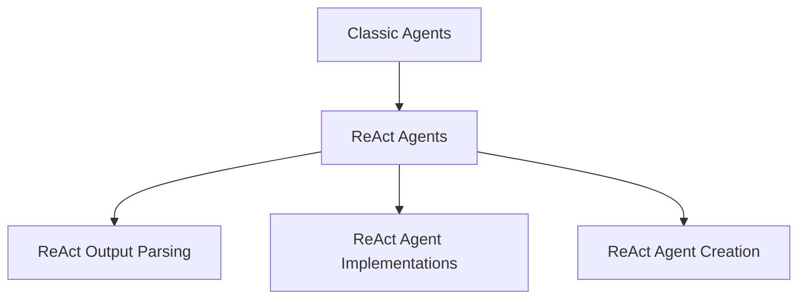

# react_agent_implementations

## Introduction

The `react_agent_implementations` module provides the core implementations for ReAct (Reasoning and Acting) agents within the `langchain_classic` framework. It includes foundational classes for agents that operate in text-world environments and a deprecated chain implementation that utilizes a docstore for information retrieval.

## Architecture

The `react_agent_implementations` module is a sub-module of the larger `classic_agents` module, specifically under `react_agents`. It works in conjunction with other ReAct-related modules such as `react_output_parsing` and `react_agent_creation` to form a complete ReAct agent system.

<!-- DIAGRAM_JSON
{
    "direction": "TD",
    "nodes": [
        {"id": "classic_agents", "label": "Classic Agents", "type": "external", "link": "classic_agents.md"},
        {"id": "react_agents", "label": "ReAct Agents", "type": "module", "link": "react_agents.md"},
        {"id": "react_output_parsing", "label": "ReAct Output Parsing", "type": "module", "link": "react_output_parsing.md"},
        {"id": "react_agent_implementations", "label": "ReAct Agent Implementations", "type": "module", "link": "react_agent_implementations.md"},
        {"id": "react_agent_creation", "label": "ReAct Agent Creation", "type": "module", "link": "react_agent_creation.md"}
    ],
    "edges": [
        {"source": "classic_agents", "target": "react_agents"},
        {"source": "react_agents", "target": "react_output_parsing"},
        {"source": "react_agents", "target": "react_agent_implementations"},
        {"source": "react_agents", "target": "react_agent_creation"}
    ],
    "groups": []
}
-->

## Core Functionality

### ReActTextWorldAgent

The `ReActTextWorldAgent` extends `ReActDocstoreAgent` to specialize in text-world environments. It enforces that exactly one tool, named "Play", must be provided. This agent is designed for interactive environments where actions are performed via a single "Play" interface.

Key characteristics:
*   **Single Tool Requirement**: Strictly requires one tool named "Play".
*   **TextWorld Integration**: Tailored for interaction within text-based simulated environments.
*   **Prompt Customization**: Overrides the default prompt to use `TEXTWORLD_PROMPT` for relevant contexts.

### ReActChain

The `ReActChain` is a **deprecated** chain implementation based on the ReAct paper. It integrates an LLM with a `Docstore` via a `DocstoreExplorer` to enable agents to perform search and lookup operations.

Key characteristics:
*   **Docstore Integration**: Uses a `DocstoreExplorer` to provide "Search" and "Lookup" tools to the agent.
*   **AgentExecutor**: Inherits from `AgentExecutor`, allowing it to run an agent with a set of tools.
*   **Deprecated**: Users are advised to use newer, more flexible agent implementations.
