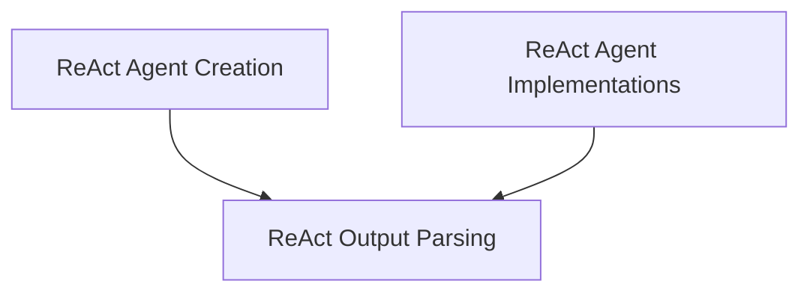

# ReAct Agents Module

## Introduction and Purpose

The `react_agents` module provides tools and implementations for creating agents based on the ReAct (Reasoning and Acting) prompting framework. ReAct agents synergize reasoning and acting in language models, enabling them to solve tasks that require dynamic interaction with their environment. This module offers foundational components for defining agent behavior, handling tool interactions, and parsing agent outputs.

## Architecture Overview

The `react_agents` module is structured into several key sub-modules, each responsible for a specific aspect of ReAct agent functionality. These sub-modules work together to facilitate the creation, execution, and interpretation of ReAct agents.

<!-- DIAGRAM_JSON
{
    "direction": "TD",
    "nodes": [
        {"id": "react_agent_creation", "label": "ReAct Agent Creation", "type": "module", "link": "react_agent_creation.md"},
        {"id": "react_agent_implementations", "label": "ReAct Agent Implementations", "type": "module", "link": "react_agent_implementations.md"},
        {"id": "react_output_parsing", "label": "ReAct Output Parsing", "type": "module", "link": "react_output_parsing.md"}
    ],
    "edges": [
        {"source": "react_agent_creation", "target": "react_output_parsing"},
        {"source": "react_agent_implementations", "target": "react_output_parsing"}
    ],
    "groups": []
}
-->

## High-Level Functionality of Sub-modules

### [ReAct Agent Creation](react_agent_creation.md)
This sub-module focuses on the core functionality for creating ReAct agents. It includes utilities for setting up the agent with a language model, tools, and a prompt template.

### [ReAct Agent Implementations](react_agent_implementations.md)
This sub-module contains specific implementations and predefined chains that leverage the ReAct paradigm. It offers ready-to-use ReAct agents for various scenarios, such as the `ReActTextWorldAgent` and the `ReActChain` for docstore interactions.

### [ReAct Output Parsing](react_output_parsing.md)
This sub-module is responsible for parsing and interpreting the output generated by ReAct-style agents. It includes parsers like `ReActJsonSingleInputOutputParser` to convert raw LLM output into structured agent actions or final answers.