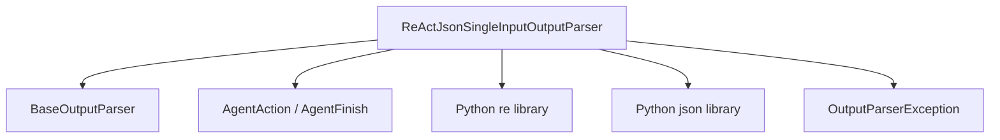

# react_output_parsing

The `react_output_parsing` module provides functionality for parsing the output of Large Language Models (LLMs) that adhere to the ReAct (Reasoning and Acting) paradigm, specifically when the tool input is in a single JSON format. This module is essential for enabling ReAct-based agents to interpret LLM responses, deciding whether to execute further actions or provide a final answer.

## Core Functionality

The primary component of this module is `ReActJsonSingleInputOutputParser`, which extends the `AgentOutputParser` from `core_output_parsers`. It is designed to process raw string outputs from an LLM and convert them into structured `AgentAction` or `AgentFinish` objects.

### `ReActJsonSingleInputOutputParser`

- **Purpose**: Parses LLM outputs to extract either an agent action (with tool and input) or a final answer.
- **Input Format**: Expects LLM output to conform to one of two patterns:
    - **Action Format**:
        ```
        Thought: agent thought here
        Action:
        ```
        ```json
        {
            "action": "search",
            "action_input": "what is the temperature in SF"
        }
        ```
        This format leads to an `AgentAction` being returned, specifying the tool to use and its input.
    - **Final Answer Format**:
        ```
        Thought: agent thought here
        Final Answer: The temperature is 100 degrees
        ```
        This format results in an `AgentFinish` being returned, containing the final output.
- **Parsing Logic**:
    - It employs a regular expression (`pattern`) to locate and extract a JSON block from the LLM's output.
    - It checks for the presence of a "Final Answer" string.
    - If a JSON action is found and a "Final Answer" is also present, it raises an `OutputParserException` due to ambiguity.
    - If a valid JSON action is parsed, it creates and returns an `AgentAction` object.
    - If no parseable action is found but a "Final Answer" is present, it extracts the answer and returns an `AgentFinish` object.
    - If neither a parseable action nor a "Final Answer" is found, or if parsing fails, it raises an `OutputParserException`.

## Architecture and Component Relationships

The `react_output_parsing` module primarily interacts with core agent and output parsing components.

<!-- DIAGRAM_JSON
{
    "direction": "TD",
    "nodes": [
        {"id": "react_parser", "label": "ReActJsonSingleInputOutputParser", "type": "component", "link": null},
        {"id": "agent_output_parser", "label": "BaseOutputParser", "type": "external", "link": "core_output_parsers.md"},
        {"id": "agent_action_finish", "label": "AgentAction / AgentFinish", "type": "external", "link": "classic_agents.md"},
        {"id": "re_lib", "label": "Python re library", "type": "component", "link": null},
        {"id": "json_lib", "label": "Python json library", "type": "component", "link": null},
        {"id": "output_parser_exception", "label": "OutputParserException", "type": "external", "link": "core_output_parsers.md"}
    ],
    "edges": [
        {"source": "react_parser", "target": "agent_output_parser"},
        {"source": "react_parser", "target": "agent_action_finish"},
        {"source": "react_parser", "target": "re_lib"},
        {"source": "react_parser", "target": "json_lib"},
        {"source": "react_parser", "target": "output_parser_exception"}
    ],
    "groups": []
}
-->


### Relationships

-   `ReActJsonSingleInputOutputParser` inherits from `BaseOutputParser`, establishing it as a specialized output parser within the system.
-   It produces `AgentAction` or `AgentFinish` objects, which are fundamental data structures for defining agent behavior and final outputs. These types are core to the [classic_agents](classic_agents.md) module.
-   The parser utilizes Python's built-in `re` and `json` libraries for pattern matching and JSON deserialization, respectively.
-   It raises `OutputParserException` (likely defined or re-exported from [core_output_parsers](core_output_parsers.md)) for any parsing failures or ambiguous outputs.

## How the Module Fits into the Overall System

The `react_output_parsing` module is an integral part of the `react_agents` submodule, which itself is a child of the [classic_agents](classic_agents.md) module. Its role is critical in the execution flow of ReAct-based agents:

1.  An LLM generates a raw text output based on the agent's prompt and scratchpad.
2.  The `ReActJsonSingleInputOutputParser` processes this raw output.
3.  It translates the LLM's natural language and structured JSON cues into explicit `AgentAction` or `AgentFinish` objects.
4.  If an `AgentAction` is returned, the agent proceeds to execute the specified tool with its given input.
5.  If an `AgentFinish` is returned, the agent concludes its operation and provides the final answer to the user.

This module therefore acts as a vital bridge, transforming unstructured LLM responses into actionable directives, enabling intelligent decision-making and tool utilization within the ReAct agent framework. It ensures that the agent can effectively understand and respond to the LLM's generated content, forming a coherent loop of reasoning and action.
