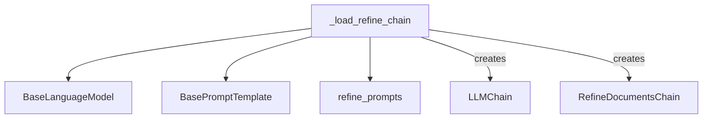

The `refine_chain_loader` module is responsible for constructing and configuring a `RefineDocumentsChain`, a specialized chain used in summarization tasks. This chain iteratively refines an initial response by processing additional documents, making it suitable for summarizing large bodies of text where a single pass might not capture all necessary details.

### Architecture and Component Relationships

The core functionality of this module is encapsulated within the `_load_refine_chain` function. This function acts as a factory, taking language models and prompt templates as input to assemble a `RefineDocumentsChain`. The `RefineDocumentsChain` itself is composed of two `LLMChain` instances: an `initial_llm_chain` for generating an initial response and a `refine_llm_chain` for iteratively improving that response.

<!-- DIAGRAM_JSON
{
    "direction": "TD",
    "nodes": [
        {"id": "_load_refine_chain", "label": "_load_refine_chain", "type": "component", "link": null},
        {"id": "RefineDocumentsChain", "label": "RefineDocumentsChain", "type": "component", "link": null},
        {"id": "LLMChain", "label": "LLMChain", "type": "external", "link": "classic_chains_base.md"},
        {"id": "BaseLanguageModel", "label": "BaseLanguageModel", "type": "external", "link": "core_language_models.md"},
        {"id": "BasePromptTemplate", "label": "BasePromptTemplate", "type": "external", "link": "core_prompts.md"},
        {"id": "refine_prompts", "label": "refine_prompts", "type": "external", "link": "refine_prompts.md"}
    ],
    "edges": [
        {"source": "_load_refine_chain", "target": "BaseLanguageModel"},
        {"source": "_load_refine_chain", "target": "BasePromptTemplate"},
        {"source": "_load_refine_chain", "target": "refine_prompts"},
        {"source": "_load_refine_chain", "target": "LLMChain", "label": "creates"},
        {"source": "_load_refine_chain", "target": "RefineDocumentsChain", "label": "creates"}
    ],
    "groups": []
}
-->

### Module Components

#### `_load_refine_chain`

The `_load_refine_chain` function is a utility for instantiating a `RefineDocumentsChain`. It abstracts away the complexity of setting up the individual `LLMChain` components required for the refinement process.

**Parameters:**

*   `llm` (`BaseLanguageModel`): The language model to use for the initial question-answering chain.
*   `question_prompt` (`BasePromptTemplate`): The prompt template used for the initial query to the LLM. Defaults to `refine_prompts.PROMPT`.
*   `refine_prompt` (`BasePromptTemplate`): The prompt template used for the refinement steps. Defaults to `refine_prompts.REFINE_PROMPT`.
*   `document_variable_name` (`str`): The name of the variable in the prompt that holds the document content. Defaults to "text".
*   `initial_response_name` (`str`): The name of the variable in the refinement prompt that holds the existing answer. Defaults to "existing_answer".
*   `refine_llm` (`BaseLanguageModel | None`): An optional language model to use specifically for the refinement chain. If not provided, the `llm` parameter will be used.
*   `verbose` (`bool | None`): Whether to print verbose output during chain execution.
*   `**kwargs` (`Any`): Additional keyword arguments to pass to the `RefineDocumentsChain` constructor.

**Functionality:**

1.  Initializes an `LLMChain` for the `initial_llm_chain` using the provided `llm` and `question_prompt`.
2.  Determines the language model for the `refine_llm_chain`, using `refine_llm` if provided, otherwise defaulting to `llm`.
3.  Initializes a second `LLMChain` for the `refine_llm_chain` using the determined language model and `refine_prompt`.
4.  Constructs and returns a `RefineDocumentsChain` using the two `LLMChain` instances and other configuration parameters.

### Integration with the Overall System

The `refine_chain_loader` module is part of the `classic_chains_summarize` package, which provides various chain implementations for summarization tasks. It depends on core components such as `core_language_models` for language model abstractions and `core_prompts` for prompt templating. It also relies on the `LLMChain` from `classic_chains_base` as a foundational building block for constructing its specialized summarization chain.

By providing a clear and configurable way to load `RefineDocumentsChain`, this module enables other parts of the system to easily integrate iterative summarization capabilities, particularly useful in applications requiring detailed and comprehensive summaries from multiple document sources.