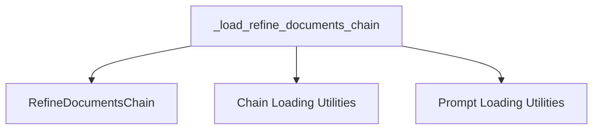

# Refine Document Chain Loader

## Module: refine_document_chain_loader

### Introduction
The `refine_document_chain_loader` module is a crucial component within the `classic_chains_loading` package. Its primary purpose is to provide a mechanism for loading and configuring `RefineDocumentsChain` instances. The `RefineDocumentsChain` is designed for multi-step document processing, where an initial Language Model (LLM) chain processes documents, and a subsequent LLM chain refines the output based on the initial processing. This module enables the creation of complex document processing workflows from declarative configurations.

### Architecture and Component Relationships

The core functionality of this module is encapsulated in the `_load_refine_documents_chain` function. This function acts as an orchestrator, interpreting a configuration dictionary or file paths to correctly instantiate and set up a `RefineDocumentsChain`.

The process involves loading several key components:
1.  **Initial LLM Chain**: The function requires a configuration for the initial LLM chain (`initial_llm_chain`) or a path to its definition (`initial_llm_chain_path`). This chain performs the first pass of document processing. The loading of this chain is delegated to general chain loading utilities.
2.  **Refine LLM Chain**: Similarly, a configuration for the refinement LLM chain (`refine_llm_chain`) or its path (`refine_llm_chain_path`) is needed. This chain refines the output generated by the initial LLM chain. This also relies on general chain loading utilities.
3.  **Document Prompt**: A `document_prompt` configuration or `document_prompt_path` is used to load the prompt template that guides how documents are presented to the LLM chains. Prompt loading utilities handle this aspect.

Once these essential components are successfully loaded, they are used to construct and return a fully configured `RefineDocumentsChain` instance.

### How it Fits into the Overall System

The `refine_document_chain_loader` module is integral to the "classic" LangChain architecture by offering a standardized and flexible way to create `RefineDocumentsChain` objects from external configurations. This design promotes modularity, reusability, and easier management of complex document processing logic. It interacts with the following modules:

*   **[classic_chains_base](classic_chains_base.md)**: This module depends on `classic_chains_base` for the definition of the `RefineDocumentsChain` class, which it instantiates.
*   **[classic_chains_loading](classic_chains_loading.md)**: It leverages other chain loading utilities, such as `load_chain_from_config` and `load_chain`, which are likely found within the broader `classic_chains_loading` module or its siblings.
*   **[classic_prompts](classic_prompts.md)**: For loading prompt templates using functions like `load_prompt_from_config` and `load_prompt`.

### Core Components

#### `_load_refine_documents_chain`

This function is responsible for parsing a configuration dictionary or file paths to load an initial LLM chain, a refinement LLM chain, and a document prompt, then assembling them into a `RefineDocumentsChain`. It ensures that all necessary components are present and correctly configured before creating the chain.

<!-- DIAGRAM_JSON
{
    "direction": "TD",
    "nodes": [
        {"id": "load_refine_documents_chain", "label": "_load_refine_documents_chain", "type": "component", "link": null},
        {"id": "refine_documents_chain", "label": "RefineDocumentsChain", "type": "external", "link": "classic_chains_base.md"},
        {"id": "chain_loading_utils", "label": "Chain Loading Utilities", "type": "external", "link": "classic_chains_loading.md"},
        {"id": "prompt_loading_utils", "label": "Prompt Loading Utilities", "type": "external", "link": "classic_prompts.md"}
    ],
    "edges": [
        {"source": "load_refine_documents_chain", "target": "refine_documents_chain"},
        {"source": "load_refine_documents_chain", "target": "chain_loading_utils"},
        {"source": "load_refine_documents_chain", "target": "prompt_loading_utils"}
    ],
    "groups": []
}
-->

