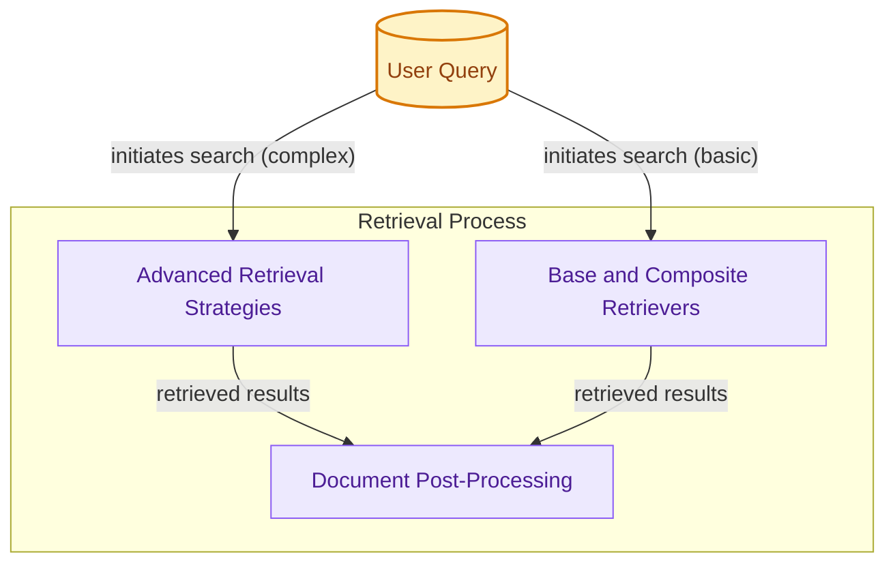

# Retrieval Systems

This module provides various strategies and components for document retrieval, including base retriever implementations, advanced querying techniques, and methods for filtering and re-ranking search results.

<!-- DIAGRAM_JSON
{
    "direction": "TD",
    "nodes": [
        {"id": "user_query", "label": "User Query", "type": "external", "link": null},
        {"id": "base_and_composite_retrievers", "label": "Base and Composite Retrievers", "type": "module", "link": "base_and_composite_retrievers.md"},
        {"id": "advanced_retrieval_strategies", "label": "Advanced Retrieval Strategies", "type": "module", "link": "advanced_retrieval_strategies.md"},
        {"id": "document_post_processing", "label": "Document Post-Processing", "type": "module", "link": "document_post_processing.md"}
    ],
    "edges": [
        {"source": "user_query", "target": "advanced_retrieval_strategies", "label": "initiates search (complex)"},
        {"source": "user_query", "target": "base_and_composite_retrievers", "label": "initiates search (basic)"},
        {"source": "advanced_retrieval_strategies", "target": "document_post_processing", "label": "retrieved results"},
        {"source": "base_and_composite_retrievers", "target": "document_post_processing", "label": "retrieved results"}
    ],
    "groups": [
        {"id": "retrieval_process", "label": "Retrieval Process", "role": "analytical", "nodes": ["base_and_composite_retrievers", "advanced_retrieval_strategies", "document_post_processing"]}
    ]
}
-->
