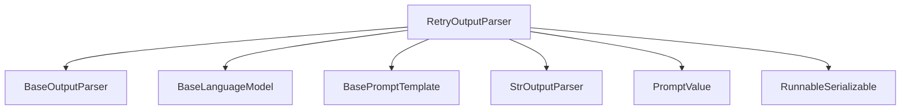

# retry_output_parser Module Documentation

## Introduction
The `retry_output_parser` module provides a robust mechanism for handling parsing errors that may occur when processing outputs from Language Models (LLMs). It wraps an existing output parser and, in case of a parsing failure, attempts to fix the output by feeding the original prompt and the problematic completion to another LLM, along with an explanation of the parsing error. This allows for more resilient and fault-tolerant parsing of LLM generations.

## `RetryOutputParser` Class
The `RetryOutputParser` class is the core component of this module, designed to enhance the reliability of output parsing.

```python
class RetryOutputParser(BaseOutputParser[T]):
    parser: Annotated[BaseOutputParser[T], SkipValidation()]
    retry_chain: Annotated[
        RunnableSerializable[RetryOutputParserRetryChainInput, str] | Any,
        SkipValidation(),
    ]
    max_retries: int = 1
    legacy: bool = True
```

### Purpose
This class acts as a wrapper around another `BaseOutputParser`. If the wrapped parser fails to parse an LLM's completion, `RetryOutputParser` leverages a `retry_chain` (typically another LLM chain) to attempt to correct the completion. It can perform a configurable number of retries before ultimately raising an `OutputParserException`.

### Parameters
- **`parser`**: (Type: `BaseOutputParser[T]`) The underlying output parser that `RetryOutputParser` will use to attempt parsing first.
- **`retry_chain`**: (Type: `RunnableSerializable[RetryOutputParserRetryChainInput, str] | Any`) A runnable or LLMChain responsible for attempting to fix the completion. It takes the original `prompt` and the `completion` (and optionally the `error` in async calls) as input and returns a corrected `completion` string.
- **`max_retries`**: (Type: `int`, Default: `1`) The maximum number of times the `retry_chain` will be invoked to fix parsing errors.
- **`legacy`**: (Type: `bool`, Default: `True`) A flag indicating whether to use the `run`/`arun` methods (legacy) or `invoke`/`ainvoke` methods for the `retry_chain`.

### Class Methods

#### `from_llm`
```python
@classmethod
def from_llm(
    cls,
    llm: BaseLanguageModel,
    parser: BaseOutputParser[T],
    prompt: BasePromptTemplate = NAIVE_RETRY_PROMPT,
    max_retries: int = 1,
) -> RetryOutputParser[T]:
```
A convenience class method to create an instance of `RetryOutputParser`.
- **`llm`**: (Type: [BaseLanguageModel](base_language_models.md)) The language model to use for the retry mechanism.
- **`parser`**: (Type: [BaseOutputParser](base_output_parsers.md)`[T]`) The parser to be wrapped.
- **`prompt`**: (Type: [BasePromptTemplate](prompt_templates_base.md), Default: `NAIVE_RETRY_PROMPT`) The prompt template to guide the `llm` in fixing the output.
- **`max_retries`**: (Type: `int`, Default: `1`) The maximum number of retries.

### Instance Methods

#### `parse_with_prompt`
```python
def parse_with_prompt(self, completion: str, prompt_value: PromptValue) -> T:
```
Parses the output of an LLM call. If parsing fails, it retries fixing the `completion` using the `retry_chain` up to `max_retries` times.
- **`completion`**: (Type: `str`) The raw output string from the LLM.
- **`prompt_value`**: (Type: [PromptValue](core_prompt_values.md)) The prompt used to generate the `completion`.
- **Returns**: (Type: `T`) The parsed output.
- **Raises**: `OutputParserException` if parsing fails after all retries.

#### `aparse_with_prompt`
```python
async def aparse_with_prompt(self, completion: str, prompt_value: PromptValue) -> T:
```
Asynchronous version of `parse_with_prompt`.
- **`completion`**: (Type: `str`) The raw output string from the LLM.
- **`prompt_value`**: (Type: [PromptValue](core_prompt_values.md)) The prompt used to generate the `completion`.
- **Returns**: (Type: `T`) The parsed output.
- **Raises**: `OutputParserException` if parsing fails after all retries.

#### `parse`
```python
@override
def parse(self, completion: str) -> T:
```
This method is not implemented for `RetryOutputParser` and will raise a `NotImplementedError`, as parsing requires the original `PromptValue`.

#### `get_format_instructions`
```python
@override
def get_format_instructions(self) -> str:
```
Delegates to the wrapped `parser` to retrieve its format instructions.

### Properties

#### `_type`
(Type: `str`) Returns the string identifier for this parser, which is "retry".

#### `OutputType`
(Type: `type[T]`) Returns the output type of the wrapped parser.

## Architecture Diagram

<!-- DIAGRAM_JSON
{
    "direction": "TD",
    "nodes": [
        {"id": "retry_output_parser", "label": "RetryOutputParser", "type": "component", "link": null},
        {"id": "base_output_parser", "label": "BaseOutputParser", "type": "external", "link": "base_output_parsers.md"},
        {"id": "base_language_model", "label": "BaseLanguageModel", "type": "external", "link": "base_language_models.md"},
        {"id": "base_prompt_template", "label": "BasePromptTemplate", "type": "external", "link": "prompt_templates_base.md"},
        {"id": "str_output_parser", "label": "StrOutputParser", "type": "external", "link": "core_output_parsers.md"},
        {"id": "prompt_value", "label": "PromptValue", "type": "external", "link": "core_prompt_values.md"},
        {"id": "runnable_serializable", "label": "RunnableSerializable", "type": "external", "link": "base_runnables.md"}
    ],
    "edges": [
        {"source": "retry_output_parser", "target": "base_output_parser"},
        {"source": "retry_output_parser", "target": "base_language_model"},
        {"source": "retry_output_parser", "target": "base_prompt_template"},
        {"source": "retry_output_parser", "target": "str_output_parser"},
        {"source": "retry_output_parser", "target": "prompt_value"},
        {"source": "retry_output_parser", "target": "runnable_serializable"}
    ],
    "groups": []
}
-->
