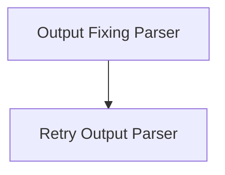

# Robust Parsers Module

The `robust_parsers` module provides advanced output parsing capabilities designed to enhance the reliability of language model interactions. It includes mechanisms for automatically fixing parsing errors and retrying parsing attempts based on feedback from the parsing process.

## Architecture

The `robust_parsers` module is composed of two primary sub-modules:

- `output_fixing_parser`: Focuses on correcting malformed outputs.
- `retry_output_parser`: Manages the retry logic for parsing failures by interacting with an LLM.

Both sub-modules wrap existing parsers and leverage language models to handle exceptions, making the parsing process more resilient to unexpected or incorrect outputs.

<!-- DIAGRAM_JSON
{
    "direction": "TD",
    "nodes": [
        {"id": "output_fixing_parser", "label": "Output Fixing Parser", "type": "module", "link": "output_fixing_parser.md"},
        {"id": "retry_output_parser", "label": "Retry Output Parser", "type": "module", "link": "retry_output_parser.md"}
    ],
    "edges": [
        {"source": "output_fixing_parser", "target": "retry_output_parser"}
    ],
    "groups": []
}
-->

## Sub-modules

### [Output Fixing Parser](output_fixing_parser.md)
This sub-module contains the `OutputFixingParser` component, which is designed to wrap another output parser and attempt to fix any parsing errors that occur. It achieves this by feeding the erroneous output and the original format instructions back to a language model, requesting a corrected output.

### [Retry Output Parser](retry_output_parser.md)
This sub-module includes the `RetryOutputParser` component. It provides a mechanism to retry parsing an LLM's completion when an initial parsing attempt fails. It passes the original prompt and the problematic completion to a language model, asking it to re-generate an output that satisfies the prompt's criteria.
