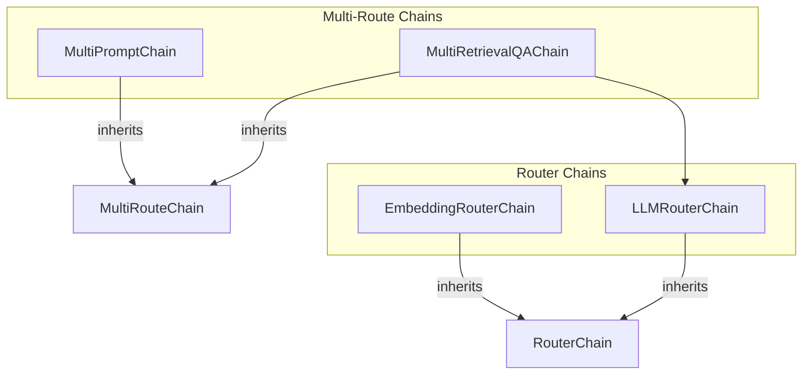

# router_chains
This module provides various chain implementations for routing inputs to different sub-chains or prompts based on specific criteria, including embedding-based, LLM-based, multi-prompt, and multi-retrieval routing.

<!-- DIAGRAM_JSON
{
  "nodes": [
    {
      "id": "EmbeddingRouterChain",
      "label": "EmbeddingRouterChain",
      "type": "class"
    },
    {
      "id": "LLMRouterChain",
      "label": "LLMRouterChain",
      "type": "class"
    },
    {
      "id": "MultiPromptChain",
      "label": "MultiPromptChain",
      "type": "class"
    },
    {
      "id": "MultiRetrievalQAChain",
      "label": "MultiRetrievalQAChain",
      "type": "class"
    },
    {
      "id": "RouterChain",
      "label": "RouterChain",
      "type": "class",
      "is_base_class": true
    },
    {
      "id": "MultiRouteChain",
      "label": "MultiRouteChain",
      "type": "class",
      "is_base_class": true
    }
  ],
  "edges": [
    {
      "source": "EmbeddingRouterChain",
      "target": "RouterChain",
      "type": "inherits"
    },
    {
      "source": "LLMRouterChain",
      "target": "RouterChain",
      "type": "inherits"
    },
    {
      "source": "MultiPromptChain",
      "target": "MultiRouteChain",
      "type": "inherits"
    },
    {
      "source": "MultiRetrievalQAChain",
      "target": "MultiRouteChain",
      "type": "inherits"
    },
    {
      "source": "MultiRetrievalQAChain",
      "target": "LLMRouterChain",
      "type": "uses"
    }
  ],
  "groups": [
    {
      "id": "RouterChains",
      "label": "Router Chains",
      "nodes": ["EmbeddingRouterChain", "LLMRouterChain"]
    },
    {
      "id": "MultiRouteChains",
      "label": "Multi-Route Chains",
      "nodes": ["MultiPromptChain", "MultiRetrievalQAChain"]
    }
  ]
}
-->
