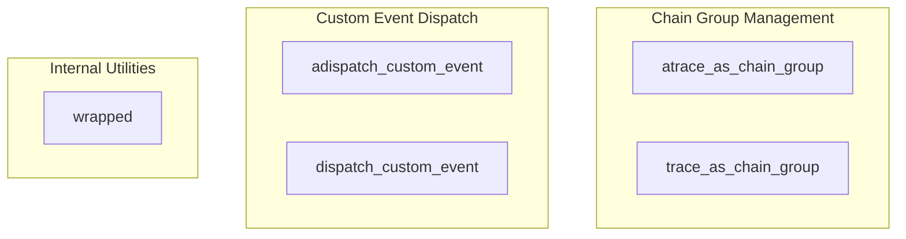

# run_and_event_managers
This module offers synchronous and asynchronous utilities for managing execution traces by grouping calls into logical chains and dispatching custom events within the LangChain callback system.

<!-- DIAGRAM_JSON
{
    "nodes": [
        {
            "id": "atrace_as_chain_group",
            "label": "atrace_as_chain_group"
        },
        {
            "id": "trace_as_chain_group",
            "label": "trace_as_chain_group"
        },
        {
            "id": "adispatch_custom_event",
            "label": "adispatch_custom_event"
        },
        {
            "id": "dispatch_custom_event",
            "label": "dispatch_custom_event"
        },
        {
            "id": "wrapped",
            "label": "wrapped"
        }
    ],
    "edges": [],
    "groups": [
        {
            "id": "chain_group_management",
            "label": "Chain Group Management",
            "nodes": [
                "atrace_as_chain_group",
                "trace_as_chain_group"
            ]
        },
        {
            "id": "custom_event_dispatch",
            "label": "Custom Event Dispatch",
            "nodes": [
                "adispatch_custom_event",
                "dispatch_custom_event"
            ]
        },
        {
            "id": "internal_utilities",
            "label": "Internal Utilities",
            "nodes": [
                "wrapped"
            ]
        }
    ]
}
-->
