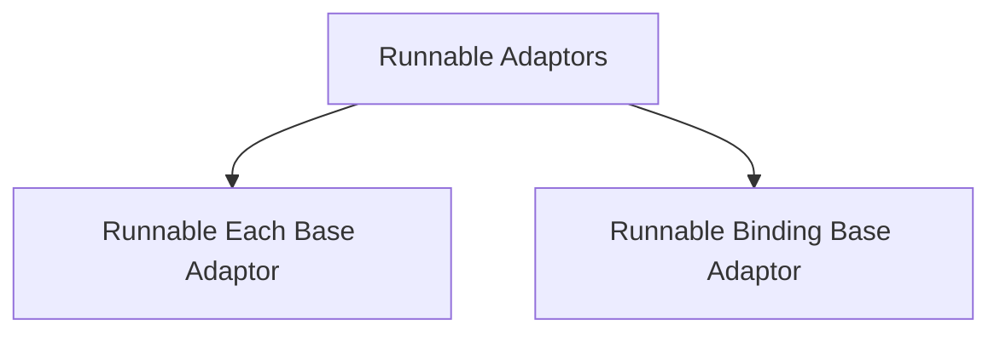

# Runnable Adaptors Module

## Introduction

The `runnable_adaptors` module provides foundational classes for creating flexible and composable runnables within the LangChain Core framework. These adaptors allow for modifying the behavior of existing runnables, such as applying an operation to each item in a list or binding additional configurations and keyword arguments.

## Architecture

The `runnable_adaptors` module contains two primary base classes: `RunnableEachBase` and `RunnableBindingBase`. These classes serve as building blocks for more specialized runnable implementations.

<!-- DIAGRAM_JSON
{
    "direction": "TD",
    "nodes": [
        {"id": "runnable_adaptors", "label": "Runnable Adaptors", "type": "module"},
        {"id": "runnable_each_base_adaptor", "label": "Runnable Each Base Adaptor", "type": "module", "link": "runnable_each_base_adaptor.md"},
        {"id": "runnable_binding_base_adaptor", "label": "Runnable Binding Base Adaptor", "type": "module", "link": "runnable_binding_base_adaptor.md"}
    ],
    "edges": [
        {"source": "runnable_adaptors", "target": "runnable_each_base_adaptor"},
        {"source": "runnable_adaptors", "target": "runnable_binding_base_adaptor"}
    ],
    "groups": []
}
-->

## Sub-modules

### [Runnable Each Base Adaptor](runnable_each_base_adaptor.md)
This sub-module provides the `RunnableEachBase` class, which is designed to apply a given `Runnable` to each element of an input sequence, returning a list of outputs. It is particularly useful for parallelizing operations over collections of data.

### [Runnable Binding Base Adaptor](runnable_binding_base_adaptor.md)
This sub-module includes the `RunnableBindingBase` class, which acts as a wrapper around another `Runnable`. It allows for binding additional keyword arguments and configuration settings that will be passed to the underlying `Runnable` during invocation, enabling flexible customization of runnable behavior.
