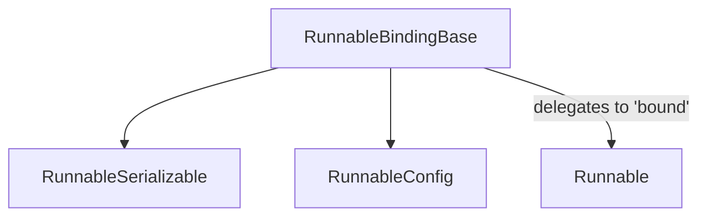

# runnable_binding_base_adaptor

The `runnable_binding_base_adaptor` module provides the foundational `RunnableBindingBase` class, which serves as a powerful adaptor for creating specialized `Runnable` instances. This class enables the delegation of execution to an underlying `Runnable` while applying a consistent set of `kwargs` and configuration settings, promoting reusability and modularity within the LangChain expression language (LCEL).

<!-- DIAGRAM_JSON
{
    "direction": "TD",
    "nodes": [
        {"id": "runnable_binding_base", "label": "RunnableBindingBase", "type": "component", "link": null},
        {"id": "runnable_serializable", "label": "RunnableSerializable", "type": "external", "link": "configurable_runnables.md"},
        {"id": "runnable", "label": "Runnable", "type": "external", "link": "core_runnable_api.md"},
        {"id": "runnable_config", "label": "RunnableConfig", "type": "external", "link": "runnable_config.md"}
    ],
    "edges": [
        {"source": "runnable_binding_base", "target": "runnable_serializable"},
        {"source": "runnable_binding_base", "target": "runnable", "label": "delegates to 'bound'"},
        {"source": "runnable_binding_base", "target": "runnable_config", "label": "uses"}
    ],
    "groups": []
}
-->

### Purpose and Core Functionality

The primary purpose of `RunnableBindingBase` is to act as a wrapper or adaptor for other `Runnable` objects. It allows developers to create a new `Runnable` that encapsulates another `Runnable`, along with a predefined set of keyword arguments (`kwargs`) and configuration options. This is particularly useful for:

*   **Parameterization**: Fixing certain parameters for a `Runnable` without modifying its original definition.
*   **Configuration Management**: Applying specific `RunnableConfig` settings consistently across multiple invocations of the `bound` runnable.
*   **Composition**: Building more complex runnables by composing existing ones with specific default behaviors.

At its core, `RunnableBindingBase` intercepts all calls (`invoke`, `stream`, `batch`, `transform`, and their asynchronous counterparts) and forwards them to its `bound` runnable. Before forwarding, it merges any provided runtime configuration and `kwargs` with its own internal, predefined `config` and `kwargs`, ensuring that the `bound` runnable executes with the intended parameters.

### Architecture and Component Relationships

The `RunnableBindingBase` class is structured as follows:

*   **Inheritance**: It inherits from [runnable_serializable.md](configurable_runnables.md), enabling it to be serialized and deserialized.
*   **`bound` Attribute**: This crucial attribute holds the actual [runnable.md](core_runnable_api.md) instance to which all operations are delegated. This establishes a "has-a" relationship, where `RunnableBindingBase` acts as a proxy for the `bound` runnable.
*   **`kwargs` Attribute**: A dictionary of keyword arguments that are consistently passed to the `bound` runnable during its execution.
*   **`config` Attribute**: An instance of [runnable_config.md](runnable_config.md) that provides default configuration settings for the `bound` runnable.
*   **`config_factories` Attribute**: A list of callable functions that can dynamically generate or modify `RunnableConfig` objects before they are applied to the `bound` runnable. This allows for more dynamic and contextual configuration.
*   **`custom_input_type` and `custom_output_type`**: Optional attributes to explicitly override the input and output types of the `bound` runnable, providing more control over type hinting and schema generation.

All public methods of `RunnableBindingBase` (e.g., `invoke`, `stream`, `batch`) essentially perform these steps:
1.  Merge runtime `config` with the binding's `config` and apply `config_factories`.
2.  Merge runtime `kwargs` with the binding's `kwargs`.
3.  Call the corresponding method on the `bound` runnable with the merged configuration and `kwargs`.

### How the Module Fits into the Overall System

The `runnable_binding_base_adaptor` module is an integral part of the `core_runnables` framework, specifically within the [runnable_adaptors](runnable_adaptors.md) sub-module. It provides a fundamental mechanism for enhancing and controlling the execution of `Runnable` objects without altering their original source code.

By offering a standardized way to bind parameters and configurations, `RunnableBindingBase` facilitates:

*   **Building Reusable Components**: Developers can define base runnables and then create multiple bindings with different default parameters for various use cases.
*   **Pipeline Construction**: In complex LangChain Expression Language (LCEL) pipelines, `RunnableBindingBase` allows for fine-grained control over individual steps, enabling the injection of specific settings or data transformations at different points in the chain.
*   **Runtime Customization**: While the `RunnableBindingBase` itself provides static bindings, the `config_factories` allow for dynamic adjustments to the configuration based on the execution environment or other runtime factors.

This adaptability and control are crucial for building robust, flexible, and maintainable AI applications using LangChain.