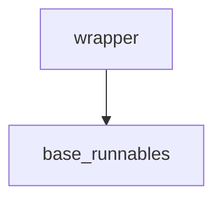

# `runnable_config` Module Documentation

## Introduction

The `runnable_config` module, part of the larger `core_runnables` package, is responsible for providing configuration-related utilities, particularly a critical wrapper for robust exception handling during the execution of runnables. Its primary function is to ensure that asynchronous operations within runnables do not encounter issues with `StopIteration` exceptions, which can lead to unexpected behavior in `asyncio.Future` objects.

## Comprehensive Documentation

### Purpose and Core Functionality

The core functionality of this module is encapsulated in the `wrapper` function. This function acts as a safeguard, wrapping the execution of other functions (presumably runnable components) to catch `StopIteration` exceptions. In asynchronous Python, raising `StopIteration` directly from a coroutine or an `asyncio.Future` can cause a `TypeError` and leave the future indefinitely pending. The `wrapper` mitigates this by converting any caught `StopIteration` into a `RuntimeError`, thus ensuring more predictable and stable asynchronous execution.

### Architecture and Component Relationships

The `runnable_config` module is a leaf module within the `core_runnables` family. Its sole explicit component, the `wrapper` function, is designed to be applied to callables that are part of the runnable execution flow. This implies a direct dependency on the fundamental `Runnable` abstractions defined in the `base_runnables` module, as the `wrapper` is intrinsically tied to how these runnables are executed and managed, especially in contexts that might involve asynchronous processing.

### How the Module Fits into the Overall System

This module plays a crucial role in the stability and reliability of the `langchain_core`'s runnable architecture. By handling `StopIteration` exceptions gracefully, it prevents common pitfalls in asynchronous programming, ensuring that chains and agents built upon the runnable interface can execute reliably without unexpected crashes or hangs. It acts as a foundational utility that underpins the robust execution of all runnables, particularly in environments leveraging `asyncio`.

## Module Components

### `wrapper`

- **Located in:** `libs/core/langchain_core/runnables/config.py`
- **Description:** A function decorator or utility that wraps the execution of a callable. It intercepts `StopIteration` exceptions raised by the wrapped function and re-raises them as `RuntimeError`. This is vital for maintaining the integrity of `asyncio.Future` objects and preventing `TypeError` when `StopIteration` is propagated in an asynchronous context.

```python
    def wrapper() -> T:
        try:
            return func(*args, **kwargs)
        except StopIteration as exc:
            # StopIteration can't be set on an asyncio.Future
            # it raises a TypeError and leaves the Future pending forever
            # so we need to convert it to a RuntimeError
            raise RuntimeError from exc
```

<!-- DIAGRAM_JSON
{
    "direction": "TD",
    "nodes": [
        {"id": "wrapper", "label": "wrapper", "type": "component", "link": null},
        {"id": "base_runnables", "label": "base_runnables", "type": "external", "link": "base_runnables.md"}
    ],
    "edges": [
        {"source": "wrapper", "target": "base_runnables"}
    ],
    "groups": []
}
-->

