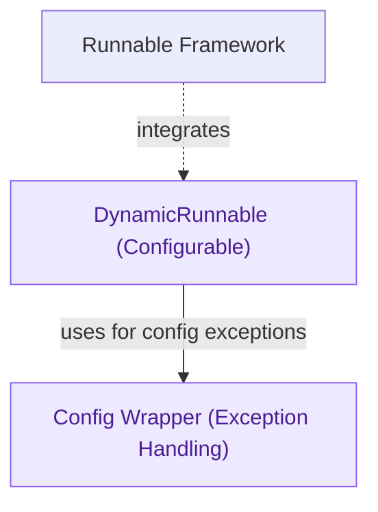

# Runnable Configuration

The `runnable_configuration` module facilitates dynamic configuration of `Runnable` instances through `DynamicRunnable`, allowing their behavior to adapt at runtime. This enhances flexibility and enables customizable component interactions within the LangChain expression language.

<!-- DIAGRAM_JSON
{
    "direction": "TD",
    "nodes": [
        {
            "id": "dynamic_runnable",
            "label": "DynamicRunnable (Configurable)",
            "type": "component",
            "link": null
        },
        {
            "id": "config_wrapper",
            "label": "Config Wrapper (Exception Handling)",
            "type": "component",
            "link": null
        },
        {
            "id": "runnable_framework",
            "label": "Runnable Framework",
            "type": "external",
            "link": "runnable_framework.md"
        }
    ],
    "edges": [
        {
            "source": "dynamic_runnable",
            "target": "config_wrapper",
            "label": "uses for config exceptions"
        },
        {
            "source": "runnable_framework",
            "target": "dynamic_runnable",
            "label": "integrates"
        }
    ],
    "groups": []
}
-->
