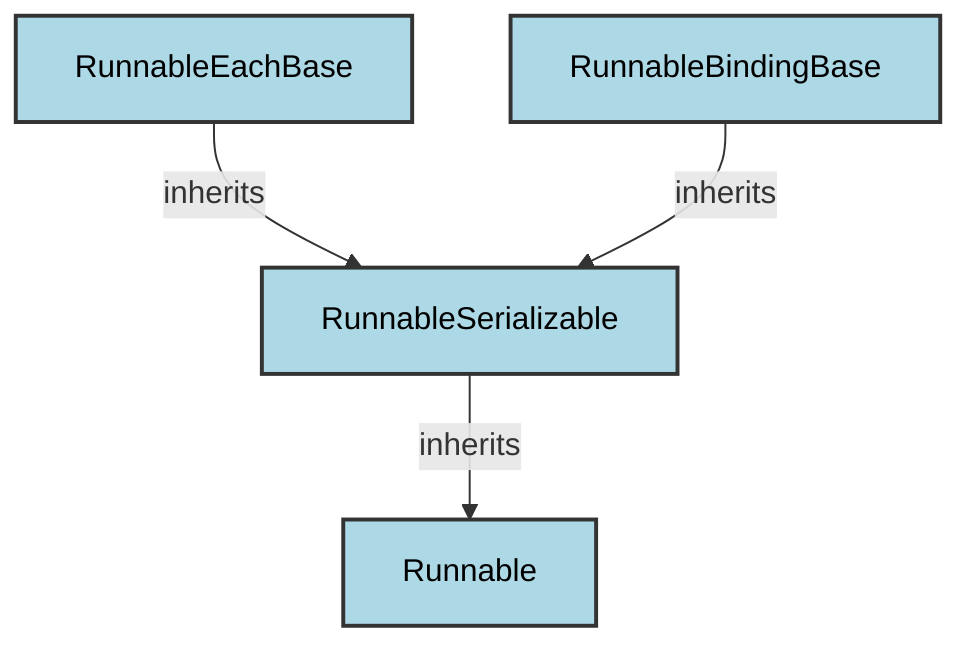

# runnable_core
The `runnable_core` module defines foundational classes for composable units of work, including a base `Runnable` and its serializable and specialized derivatives for batch processing and argument binding.

<!-- DIAGRAM_JSON
{
    "nodes": [
        {
            "id": "Runnable",
            "label": "Runnable",
            "type": "class"
        },
        {
            "id": "RunnableSerializable",
            "label": "RunnableSerializable",
            "type": "class"
        },
        {
            "id": "RunnableEachBase",
            "label": "RunnableEachBase",
            "type": "class"
        },
        {
            "id": "RunnableBindingBase",
            "label": "RunnableBindingBase",
            "type": "class"
        }
    ],
    "edges": [
        {
            "source": "RunnableSerializable",
            "target": "Runnable",
            "type": "inherits"
        },
        {
            "source": "RunnableEachBase",
            "target": "RunnableSerializable",
            "type": "inherits"
        },
        {
            "source": "RunnableBindingBase",
            "target": "RunnableSerializable",
            "type": "inherits"
        }
    ],
    "groups": []
}
-->
