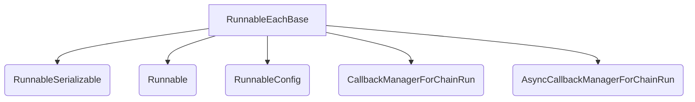

# `runnable_each_base_adaptor`

The `runnable_each_base_adaptor` module provides the `RunnableEachBase` class, a foundational component within the LangChain Core's runnable system. It enables the application of a given `Runnable` to each element of an input sequence, effectively transforming a list of inputs into a list of outputs. This module is designed to be extended by other `RunnableEach` subclasses that require custom initialization arguments.

## Core Functionality

The `RunnableEachBase` class is a specialized `Runnable` that orchestrates the execution of another `Runnable` (referred to as `self.bound`) over a collection of inputs. Its primary function is to facilitate batch processing, where an operation is applied uniformly across multiple items.

Key features and functionalities include:

*   **Batch Processing**: It takes a list of inputs and applies the `self.bound` runnable to each input, returning a list of corresponding outputs.
*   **Schema Management**: It dynamically generates input and output schemas for lists based on the bound runnable's schemas, ensuring type safety and proper serialization.
*   **Serialization**: As a `RunnableSerializable`, it supports serialization, allowing runnables to be easily stored and loaded.
*   **Callback Integration**: It properly integrates with LangChain's callback system, propagating parent run managers to child runs for detailed tracing and monitoring.
*   **Asynchronous Execution**: It supports both synchronous (`invoke`) and asynchronous (`ainvoke`) execution of the batch operation.

## Architecture and Component Relationships

The `runnable_each_base_adaptor` module, specifically the `RunnableEachBase` class, plays a crucial role in the `core_runnables` ecosystem. It inherits from `RunnableSerializable` and composes a `Runnable` instance (`self.bound`) to perform its core logic.

<!-- DIAGRAM_JSON
{
    "direction": "TD",
    "nodes": [
        {"id": "runnable_each_base", "label": "RunnableEachBase", "type": "component", "link": null},
        {"id": "runnable_serializable", "label": "RunnableSerializable", "type": "external", "link": "configurable_runnables.md"},
        {"id": "runnable", "label": "Runnable", "type": "external", "link": "core_runnable_api.md"},
        {"id": "runnable_config", "label": "RunnableConfig", "type": "external", "link": "runnable_config.md"},
        {"id": "callback_manager", "label": "CallbackManagerForChainRun", "type": "external", "link": "core_callbacks.md"},
        {"id": "async_callback_manager", "label": "AsyncCallbackManagerForChainRun", "type": "external", "link": "core_callbacks.md"}
    ],
    "edges": [
        {"source": "runnable_each_base", "target": "runnable_serializable"},
        {"source": "runnable_each_base", "target": "runnable"},
        {"source": "runnable_each_base", "target": "runnable_config"},
        {"source": "runnable_each_base", "target": "callback_manager"},
        {"source": "runnable_each_base", "target": "async_callback_manager"}
    ],
    "groups": []
}
-->

### Component Breakdown:

*   **`RunnableEachBase`**: The central component of this module. It acts as an adaptor, applying a single `Runnable` to multiple inputs.
*   **`bound` (type `Runnable`)**: An internal attribute of `RunnableEachBase` that holds the actual `Runnable` instance to be executed on each item of the input list. This represents a compositional relationship where `RunnableEachBase` uses another `Runnable` to achieve its functionality. For more details, see [core_runnable_api.md](core_runnable_api.md).
*   **`RunnableSerializable`**: The base class from which `RunnableEachBase` inherits. It provides the foundational capabilities for serialization and common runnable behaviors. Refer to [configurable_runnables.md](configurable_runnables.md) for more information.
*   **`RunnableConfig`**: Used to pass configuration settings down to the bound runnable during invocation, including callback managers and other execution parameters. See [runnable_config.md](runnable_config.md) for details.
*   **`CallbackManagerForChainRun`** and **`AsyncCallbackManagerForChainRun`**: These are used to manage callbacks during synchronous and asynchronous execution, respectively, allowing for event handling and tracing. Further details can be found in [core_callbacks.md](core_callbacks.md).

## Integration with the Overall System

The `runnable_each_base_adaptor` module is a vital part of the `core_runnables` framework, located within the `libs/core/langchain_core/runnables/base.py` file. It serves as an abstract base for implementing specific "each" runnables. By providing a standardized way to apply a single runnable to multiple inputs, it promotes code reuse and simplifies the creation of complex data processing pipelines.

It underpins higher-level constructs that require iterating over lists of data, making it a flexible building block for various LangChain applications, such as processing batches of documents, executing tools for multiple entities, or transforming lists of messages. It exemplifies the modular and extensible design of the LangChain Core, allowing developers to combine simple runnables into more sophisticated workflows.
