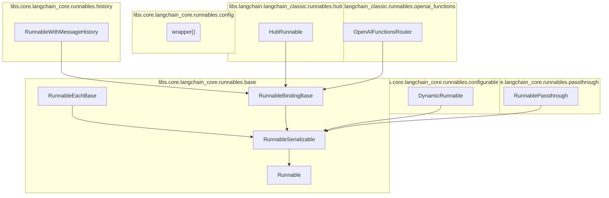

# runnable_framework
This module provides a framework for composable units of work called Runnables, enabling invocation, batching, streaming, and serialization. It includes specialized runnables for managing chat history, dynamic configuration, and routing based on OpenAI functions.

<!-- DIAGRAM_JSON
{
    "nodes": [
        {
            "id": "runnable_framework",
            "label": "runnable_framework",
            "type": "module"
        },
        {
            "id": "Runnable",
            "label": "Runnable"
        },
        {
            "id": "RunnableSerializable",
            "label": "RunnableSerializable"
        },
        {
            "id": "RunnableEachBase",
            "label": "RunnableEachBase"
        },
        {
            "id": "RunnableBindingBase",
            "label": "RunnableBindingBase"
        },
        {
            "id": "wrapper",
            "label": "wrapper()"
        },
        {
            "id": "DynamicRunnable",
            "label": "DynamicRunnable"
        },
        {
            "id": "RunnableWithMessageHistory",
            "label": "RunnableWithMessageHistory"
        },
        {
            "id": "RunnablePassthrough",
            "label": "RunnablePassthrough"
        },
        {
            "id": "HubRunnable",
            "label": "HubRunnable"
        },
        {
            "id": "OpenAIFunctionsRouter",
            "label": "OpenAIFunctionsRouter"
        },
        {
            "id": "runnable_core",
            "label": "Core Runnable Abstractions",
            "type": "module",
            "link": "runnable_core.md"
        },
        {
            "id": "specialized_runnables",
            "label": "Specialized Runnable Implementations",
            "type": "module",
            "link": "specialized_runnables.md"
        },
        {
            "id": "runnable_configuration",
            "label": "Runnable Configuration and Dynamics",
            "type": "module",
            "link": "runnable_configuration.md"
        }
    ],
    "edges": [
        {
            "source": "RunnableSerializable",
            "target": "Runnable",
            "type": "inherits"
        },
        {
            "source": "RunnableEachBase",
            "target": "RunnableSerializable",
            "type": "inherits"
        },
        {
            "source": "RunnableBindingBase",
            "target": "RunnableSerializable",
            "type": "inherits"
        },
        {
            "source": "DynamicRunnable",
            "target": "RunnableSerializable",
            "type": "inherits"
        },
        {
            "source": "RunnablePassthrough",
            "target": "RunnableSerializable",
            "type": "inherits"
        },
        {
            "source": "RunnableWithMessageHistory",
            "target": "RunnableBindingBase",
            "type": "inherits"
        },
        {
            "source": "HubRunnable",
            "target": "RunnableBindingBase",
            "type": "inherits"
        },
        {
            "source": "OpenAIFunctionsRouter",
            "target": "RunnableBindingBase",
            "type": "inherits"
        },
        {
            "source": "runnable_framework",
            "target": "runnable_core"
        },
        {
            "source": "runnable_framework",
            "target": "specialized_runnables"
        },
        {
            "source": "runnable_framework",
            "target": "runnable_configuration"
        }
    ],
    "groups": [
        {
            "id": "group_base",
            "label": "libs.core.langchain_core.runnables.base",
            "nodes": [
                "Runnable",
                "RunnableSerializable",
                "RunnableEachBase",
                "RunnableBindingBase"
            ]
        },
        {
            "id": "group_config",
            "label": "libs.core.langchain_core.runnables.config",
            "nodes": [
                "wrapper"
            ]
        },
        {
            "id": "group_configurable",
            "label": "libs.core.langchain_core.runnables.configurable",
            "nodes": [
                "DynamicRunnable"
            ]
        },
        {
            "id": "group_history",
            "label": "libs.core.langchain_core.runnables.history",
            "nodes": [
                "RunnableWithMessageHistory"
            ]
        },
        {
            "id": "group_passthrough",
            "label": "libs.core.langchain_core.runnables.passthrough",
            "nodes": [
                "RunnablePassthrough"
            ]
        },
        {
            "id": "group_hub",
            "label": "libs.langchain.langchain_classic.runnables.hub",
            "nodes": [
                "HubRunnable"
            ]
        },
        {
            "id": "group_openai_functions",
            "label": "libs.langchain.langchain_classic.runnables.openai_functions",
            "nodes": [
                "OpenAIFunctionsRouter"
            ]
        }
    ]
}
-->
