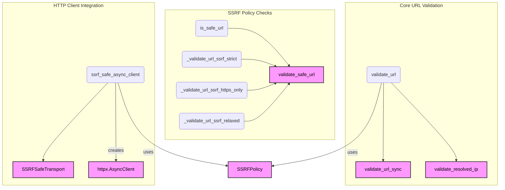

# security_utilities
This module provides functions for URL validation and Server-Side Request Forgery (SSRF) protection, including asynchronous URL validation with DNS resolution and utilities for creating SSRF-safe HTTP clients.

<!-- DIAGRAM_JSON
{
  "nodes": [
    {"id": "validate_url", "label": "validate_url"},
    {"id": "is_safe_url", "label": "is_safe_url"},
    {"id": "_validate_url_ssrf_strict", "label": "_validate_url_ssrf_strict"},
    {"id": "_validate_url_ssrf_https_only", "label": "_validate_url_ssrf_https_only"},
    {"id": "_validate_url_ssrf_relaxed", "label": "_validate_url_ssrf_relaxed"},
    {"id": "ssrf_safe_async_client", "label": "ssrf_safe_async_client"},
    {"id": "validate_url_sync", "label": "validate_url_sync", "isExternal": true},
    {"id": "validate_resolved_ip", "label": "validate_resolved_ip", "isExternal": true},
    {"id": "validate_safe_url", "label": "validate_safe_url", "isExternal": true},
    {"id": "SSRFPolicy", "label": "SSRFPolicy", "isExternal": true},
    {"id": "SSRFSafeTransport", "label": "SSRFSafeTransport", "isExternal": true},
    {"id": "httpx.AsyncClient", "label": "httpx.AsyncClient", "isExternal": true}
  ],
  "edges": [
    {"source": "validate_url", "target": "validate_url_sync"},
    {"source": "validate_url", "target": "validate_resolved_ip"},
    {"source": "validate_url", "target": "SSRFPolicy", "label": "uses"},
    {"source": "is_safe_url", "target": "validate_safe_url"},
    {"source": "_validate_url_ssrf_strict", "target": "validate_safe_url"},
    {"source": "_validate_url_ssrf_https_only", "target": "validate_safe_url"},
    {"source": "_validate_url_ssrf_relaxed", "target": "validate_safe_url"},
    {"source": "ssrf_safe_async_client", "target": "SSRFPolicy", "label": "uses"},
    {"source": "ssrf_safe_async_client", "target": "SSRFSafeTransport"},
    {"source": "ssrf_safe_async_client", "target": "httpx.AsyncClient", "label": "creates"}
  ],
  "groups": [
    {"id": "grp_core_url_validation", "label": "Core URL Validation", "nodes": ["validate_url", "validate_url_sync", "validate_resolved_ip"]},
    {"id": "grp_ssrf_policy_checks", "label": "SSRF Policy Checks", "nodes": ["is_safe_url", "_validate_url_ssrf_strict", "_validate_url_ssrf_https_only", "_validate_url_ssrf_relaxed", "validate_safe_url"]},
    {"id": "grp_http_client_integration", "label": "HTTP Client Integration", "nodes": ["ssrf_safe_async_client", "SSRFSafeTransport", "httpx.AsyncClient"]}
  ]
}
-->
