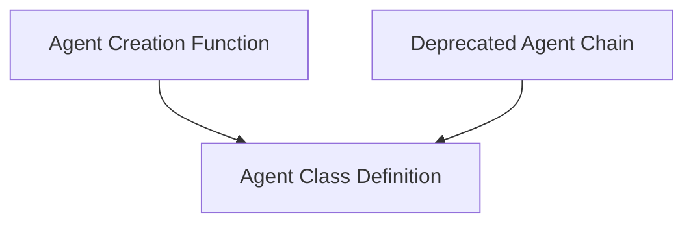

# Self-Ask With Search Agents Module

## Introduction

The `self_ask_with_search_agents` module, part of the `classic_agents.specialized_agents` within the LangChain Classic library, implements the self-ask with search prompting technique for agents. This technique allows an agent to decompose a complex question into a series of simpler, verifiable sub-questions, using a search tool to find intermediate answers before synthesizing a final response.

## Architecture

The module is structured around the core `SelfAskWithSearchAgent` class, a function for creating runnable instances of this agent, and a deprecated chain implementation. The interaction flow typically involves an input question, which the agent processes by generating follow-up questions, querying a search tool for intermediate answers, and then formulating a final answer.

<!-- DIAGRAM_JSON
{
    "direction": "TD",
    "nodes": [
        {"id": "agent_class_definition", "label": "Agent Class Definition", "type": "module", "link": "agent_class_definition.md"},
        {"id": "agent_creation_function", "label": "Agent Creation Function", "type": "module", "link": "agent_creation_function.md"},
        {"id": "deprecated_agent_chain", "label": "Deprecated Agent Chain", "type": "module", "link": "deprecated_agent_chain.md"}
    ],
    "edges": [
        {"source": "agent_creation_function", "target": "agent_class_definition"},
        {"source": "deprecated_agent_chain", "target": "agent_class_definition"}
    ],
    "groups": []
}
-->

## Sub-modules and Functionality

### [Agent Class Definition](agent_class_definition.md)
This sub-module defines the `SelfAskWithSearchAgent` class, which extends the base `Agent` class. It specifies the agent's type, how to create its prompt (which is independent of tools), and validates that exactly one tool named "Intermediate Answer" is provided. It also sets the observation and LLM prefixes.

### [Agent Creation Function](agent_creation_function.md)
This sub-module provides the `create_self_ask_with_search_agent` function. This factory function is responsible for constructing a `Runnable` sequence that implements the self-ask with search prompting. It takes an LLM, a single tool named "Intermediate Answer", and a prompt with an `agent_scratchpad` input key, then binds the LLM with a stop sequence and chains these components together with the `SelfAskOutputParser`.

### [Deprecated Agent Chain](deprecated_agent_chain.md)
This sub-module contains the `SelfAskWithSearchChain` class, which is marked as deprecated. It extends `AgentExecutor` and was designed to initialize a `SelfAskWithSearchAgent` with an LLM and a search chain (e.g., `GoogleSerperAPIWrapper`). It internally creates an "Intermediate Answer" tool based on the provided search chain. Developers should use the `create_self_ask_with_search_agent` function for new implementations.
