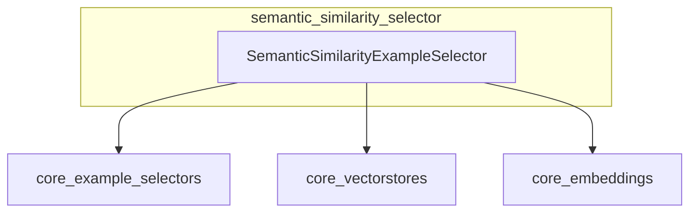

# Semantic Similarity Example Selector

The `semantic_similarity_selector` module provides functionality for selecting examples based on their semantic similarity to a given input. This is particularly useful in few-shot prompting, where relevant examples can significantly improve the performance of language models.

## Core Functionality

The primary component of this module is `SemanticSimilarityExampleSelector`, which leverages a vector store and embeddings to find the most semantically similar examples to a given query.

### `SemanticSimilarityExampleSelector`

This class is responsible for:

*   **Selecting Examples**: It provides methods to retrieve examples that are semantically similar to an input query using a configured vector store.
*   **Asynchronous Operations**: Supports both synchronous (`select_examples`) and asynchronous (`aselect_examples`) example selection.
*   **Initialization from Examples**: Can be initialized directly from a list of examples, an embedding model, and a vector store class (`from_examples`, `afrom_examples`). It converts the examples into text representations, embeds them, and stores them in the vector store.

## Architecture and Component Relationships

The `semantic_similarity_selector` module integrates with several core components to provide its functionality:

*   **[core_example_selectors.md](core_example_selectors.md)**: The `SemanticSimilarityExampleSelector` inherits from `_VectorStoreExampleSelector`, a base class in the `core_example_selectors` module. This provides the foundational structure for example selection using vector stores.
*   **[core_vectorstores.md](core_vectorstores.md)**: This module relies heavily on `VectorStore` implementations for storing and retrieving embedded examples. The `similarity_search` and `from_texts` methods of a `VectorStore` instance are central to its operation.
*   **[core_embeddings.md](core_embeddings.md)**: An `Embeddings` interface is required to convert examples into vector representations before they can be stored in a vector store and for embedding input queries for similarity search.

<!-- DIAGRAM_JSON
{
    "direction": "TD",
    "nodes": [
        {"id": "SemanticSimilarityExampleSelector", "label": "SemanticSimilarityExampleSelector", "type": "component", "link": null},
        {"id": "core_example_selectors", "label": "core_example_selectors", "type": "external", "link": "core_example_selectors.md"},
        {"id": "core_vectorstores", "label": "core_vectorstores", "type": "external", "link": "core_vectorstores.md"},
        {"id": "core_embeddings", "label": "core_embeddings", "type": "external", "link": "core_embeddings.md"}
    ],
    "edges": [
        {"source": "SemanticSimilarityExampleSelector", "target": "core_example_selectors"},
        {"source": "SemanticSimilarityExampleSelector", "target": "core_vectorstores"},
        {"source": "SemanticSimilarityExampleSelector", "target": "core_embeddings"}
    ],
    "groups": []
}
-->

## How it Fits into the Overall System

The `semantic_similarity_selector` module plays a crucial role in enabling dynamic and intelligent example selection within AI applications, particularly for few-shot learning scenarios. By semantically matching input queries with relevant examples, it helps in grounding language models with contextually appropriate information, leading to more accurate and relevant responses. It is a specialized component within the broader `core_example_selectors` module, offering a powerful method for example retrieval based on content similarity.