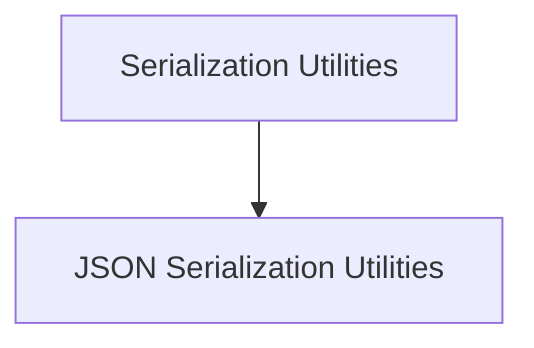

# serialization_utilities

## Introduction
The `serialization_utilities` module provides essential functions for converting embedding values (sequences of floats) into a storable format (bytes) and vice-versa. This module is a critical component within the `cache_backed_embeddings` system, enabling efficient caching of embedding results by defining how these values are serialized before storage and deserialized upon retrieval.

## Architecture
This module primarily consists of utilities that facilitate the persistence of embedding data. It sits within the `cache_backed_embeddings` module, acting as a crucial layer for data transformation between the embedding generation process and the caching mechanism.

<!-- DIAGRAM_JSON
{
    "direction": "TD",
    "nodes": [
        {"id": "serialization_utilities", "label": "Serialization Utilities", "type": "module"},
        {"id": "json_serialization_utilities", "label": "JSON Serialization Utilities", "type": "module", "link": "json_serialization_utilities.md"}
    ],
    "edges": [
        {"source": "serialization_utilities", "target": "json_serialization_utilities"}
    ],
    "groups": []
}
-->

## Sub-modules

### [JSON Serialization Utilities](json_serialization_utilities.md)
This sub-module focuses on the concrete implementation of serialization and deserialization using JSON for sequences of floats, which are typical representations of embedding vectors. It provides the core logic for converting these lists into a byte string for storage and reconstructing them when retrieved from the cache.
