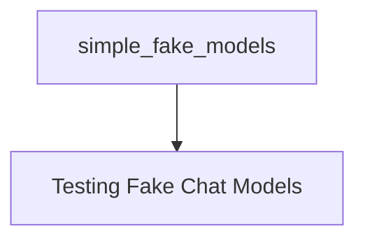

# simple_fake_models Module Documentation

## Introduction

The `simple_fake_models` module provides lightweight, simulated chat model implementations primarily designed for testing, prototyping, and development scenarios where a real Language Model (LLM) interaction is not required. These fake models allow developers to test application logic, integrate components, and validate data flows without incurring costs or delays associated with actual API calls to LLMs.

## Architecture

The `simple_fake_models` module is structured to offer different types of fake chat model behaviors, as depicted in the following diagram.

<!-- DIAGRAM_JSON
{
    "direction": "TD",
    "nodes": [
        {"id": "testing_fake_models", "label": "Testing Fake Chat Models", "type": "module", "link": "testing_fake_models.md"}
    ],
    "edges": [],
    "groups": []
}
-->

## Sub-modules

### [Testing Fake Chat Models](testing_fake_models.md)
This sub-module encapsulates the core fake chat model implementations, offering different behaviors for testing. It includes models that return a static response and models that echo the input, facilitating various testing requirements.
