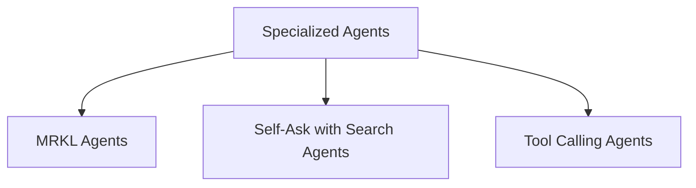

# Specialized Agents Module Documentation

The `specialized_agents` module in `langchain_classic` provides a collection of advanced agent architectures designed for specific problem-solving paradigms. These agents extend basic agent functionalities by incorporating specialized reasoning techniques and tool interaction capabilities to handle complex tasks more effectively.

## Architecture Overview

This module is structured into several sub-modules, each focusing on a distinct agent type or strategy. The core idea is to offer agents that can perform more sophisticated reasoning, utilize external tools efficiently, or follow specific thought processes like self-reflection.

<!-- DIAGRAM_JSON
{
    "direction": "TD",
    "nodes": [
        {"id": "mrkl_agents", "label": "MRKL Agents", "type": "module", "link": "mrkl_agents.md"},
        {"id": "self_ask_with_search_agents", "label": "Self-Ask with Search Agents", "type": "module", "link": "self_ask_with_search_agents.md"},
        {"id": "tool_calling_agents", "label": "Tool Calling Agents", "type": "module", "link": "tool_calling_agents.md"}
    ],
    "edges": [
        {"source": "specialized_agents", "target": "mrkl_agents"},
        {"source": "specialized_agents", "target": "self_ask_with_search_agents"},
        {"source": "specialized_agents", "target": "tool_calling_agents"}
    ],
    "groups": []
}
-->

## Sub-modules

Here's a breakdown of the specialized agents provided by this module:

### [MRKL Agents](mrkl_agents.md)
This sub-module implements the MRKL (Modular Reasoning, Knowledge and Language) system, which allows agents to combine symbolic reasoning with language models to solve problems.

### [Self-Ask with Search Agents](self_ask_with_search_agents.md)
This sub-module provides agents that utilize the self-ask with search prompting strategy. This approach enables agents to break down complex questions into a series of smaller, searchable questions, improving accuracy and reasoning.

### [Tool Calling Agents](tool_calling_agents.md)
This sub-module facilitates the creation of agents capable of dynamically calling external tools to execute specific actions. This enhances the agent's ability to interact with the environment and perform tasks that require specialized functionalities.