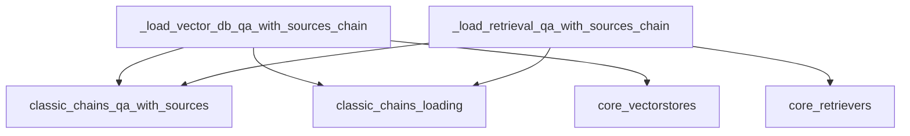

# `specialized_qa_loaders`

This module is responsible for loading specialized Question-Answering (QA) chains that incorporate sources, such as those leveraging vector databases or general retrievers. It provides utility functions to instantiate `VectorDBQAWithSourcesChain` and `RetrievalQAWithSourcesChain` based on configuration.

## Architecture and Component Relationships

The `specialized_qa_loaders` module contains functions that act as factories for specific QA chain types. These functions orchestrate the creation of complex chains by taking configuration dictionaries and external components (like vectorstores or retrievers) as input. They rely on other modules for the core chain definitions and generic chain loading mechanisms.

<!-- DIAGRAM_JSON
{
    "direction": "TD",
    "nodes": [
        {"id": "load_vector_db_qa_with_sources_chain", "label": "_load_vector_db_qa_with_sources_chain", "type": "component", "link": null},
        {"id": "load_retrieval_qa_with_sources_chain", "label": "_load_retrieval_qa_with_sources_chain", "type": "component", "link": null},
        {"id": "classic_chains_qa_with_sources", "label": "classic_chains_qa_with_sources", "type": "external", "link": "classic_chains_qa_with_sources.md"},
        {"id": "classic_chains_loading", "label": "classic_chains_loading", "type": "external", "link": "classic_chains_loading.md"},
        {"id": "core_vectorstores", "label": "core_vectorstores", "type": "external", "link": "core_vectorstores.md"},
        {"id": "core_retrievers", "label": "core_retrievers", "type": "external", "link": "core_retrievers.md"}
    ],
    "edges": [
        {"source": "load_vector_db_qa_with_sources_chain", "target": "classic_chains_qa_with_sources"},
        {"source": "load_vector_db_qa_with_sources_chain", "target": "classic_chains_loading"},
        {"source": "load_vector_db_qa_with_sources_chain", "target": "core_vectorstores"},
        {"source": "load_retrieval_qa_with_sources_chain", "target": "classic_chains_qa_with_sources"},
        {"source": "load_retrieval_qa_with_sources_chain", "target": "classic_chains_loading"},
        {"source": "load_retrieval_qa_with_sources_chain", "target": "core_retrievers"}
    ],
    "groups": []
}
-->

## Core Components

### `_load_vector_db_qa_with_sources_chain`

This function facilitates the loading of a `VectorDBQAWithSourcesChain` instance. It requires a `vectorstore` (passed via `kwargs`) and a `combine_documents_chain`. The `combine_documents_chain` can either be provided directly as a configuration dictionary within the `config` parameter or as a path to another chain that can be loaded. This design allows for flexible composition of document combination logic within the QA chain.

**Key Parameters**:
- `config` (dict): A dictionary containing configuration for the chain, including potentially `combine_documents_chain` (as a config dict) or `combine_documents_chain_path` (as a string path).
- `kwargs` (Any): Additional keyword arguments, notably including `vectorstore` which is mandatory.

**Dependencies**:
- [classic_chains_qa_with_sources](classic_chains_qa_with_sources.md): Provides the `VectorDBQAWithSourcesChain` class.
- [classic_chains_loading](classic_chains_loading.md): Used for `load_chain_from_config` and `load_chain` to load the `combine_documents_chain`.
- [core_vectorstores](core_vectorstores.md): Represents the source of the `vectorstore` dependency.

### `_load_retrieval_qa_with_sources_chain`

Similar to its vector database counterpart, this function is used to load a `RetrievalQAWithSourcesChain`. It requires a `retriever` (passed via `kwargs`) and a `combine_documents_chain`. The `combine_documents_chain` can be specified either as a configuration dictionary or a path within the `config` parameter, allowing for dynamic integration of document processing logic.

**Key Parameters**:
- `config` (dict): A dictionary containing configuration for the chain, including `combine_documents_chain` (as a config dict) or `combine_documents_chain_path` (as a string path).
- `kwargs` (Any): Additional keyword arguments, notably including `retriever` which is mandatory.

**Dependencies**:
- [classic_chains_qa_with_sources](classic_chains_qa_with_sources.md): Provides the `RetrievalQAWithSourcesChain` class.
- [classic_chains_loading](classic_chains_loading.md): Used for `load_chain_from_config` and `load_chain` to load the `combine_documents_chain`.
- [core_retrievers](core_retrievers.md): Represents the source of the `retriever` dependency.

## System Integration

This module plays a critical role within the broader `classic_chains_loading` framework, specifically under the `qa_chains_loading` section. It enables the dynamic construction of advanced Question-Answering chains that can leverage different data sources (vector databases or generic retrievers) and document combination strategies. By providing a standardized loading mechanism, it promotes modularity and reusability across various QA implementations within the LangChain Classic ecosystem. These loaders are essential for applications requiring robust information retrieval and answer generation capabilities with explicit source attribution.