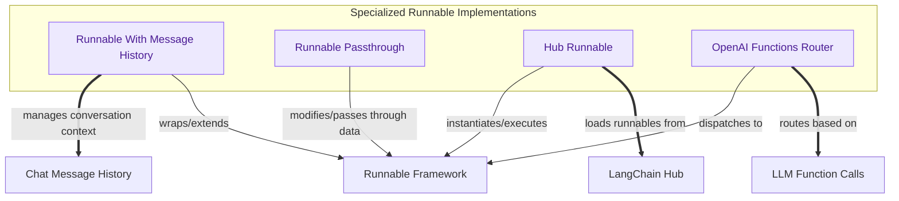

## Specialized Runnables

This module provides advanced runnable implementations, including managing conversational history, transparently passing and modifying inputs, integrating with the LangChain Hub for shared runnables, and routing execution based on OpenAI function calls.

<!-- DIAGRAM_JSON
{
    "direction": "TD",
    "nodes": [
        {
            "id": "history_runnable",
            "label": "Runnable With Message History",
            "type": "component",
            "link": null
        },
        {
            "id": "passthrough_runnable",
            "label": "Runnable Passthrough",
            "type": "component",
            "link": null
        },
        {
            "id": "hub_runnable",
            "label": "Hub Runnable",
            "type": "component",
            "link": null
        },
        {
            "id": "openai_router",
            "label": "OpenAI Functions Router",
            "type": "component",
            "link": null
        },
        {
            "id": "runnable_framework",
            "label": "Runnable Framework",
            "type": "external",
            "link": "runnable_framework.md"
        },
        {
            "id": "chat_history",
            "label": "Chat Message History",
            "type": "external",
            "link": "messages_and_history.md"
        },
        {
            "id": "langchain_hub",
            "label": "LangChain Hub",
            "type": "external",
            "link": null
        },
        {
            "id": "llm_function_calls",
            "label": "LLM Function Calls",
            "type": "external",
            "link": "language_model_interface.md"
        }
    ],
    "edges": [
        {
            "source": "history_runnable",
            "target": "runnable_framework",
            "label": "wraps/extends"
        },
        {
            "source": "history_runnable",
            "target": "chat_history",
            "label": "manages conversation context"
        },
        {
            "source": "passthrough_runnable",
            "target": "runnable_framework",
            "label": "modifies/passes through data"
        },
        {
            "source": "hub_runnable",
            "target": "langchain_hub",
            "label": "loads runnables from"
        },
        {
            "source": "hub_runnable",
            "target": "runnable_framework",
            "label": "instantiates/executes"
        },
        {
            "source": "openai_router",
            "target": "llm_function_calls",
            "label": "routes based on"
        },
        {
            "source": "openai_router",
            "target": "runnable_framework",
            "label": "dispatches to"
        }
    ],
    "groups": [
        {
            "id": "specialized_implementations",
            "label": "Specialized Runnable Implementations",
            "role": "analytical",
            "nodes": [
                "history_runnable",
                "passthrough_runnable",
                "hub_runnable",
                "openai_router"
            ]
        }
    ]
}
-->
