# Specialized Workflow Chains
This module provides a collection of specialized chains designed for advanced AI workflows, including retrieval-augmented generation, self-verified summarization, Q&A generation, map-reduce document processing, OpenAI content moderation, and LLM-driven browser automation.
<!-- DIAGRAM_JSON
{
    "direction": "TD",
    "nodes": [
        {"id": "FlareChain", "label": "Flare Chain (Retrieval Augmented Generation)", "type": "component", "link": null},
        {"id": "LLMSummarizationCheckerChain", "label": "LLM Summarization Checker Chain (Self-Verification)", "type": "component", "link": null},
        {"id": "QAGenerationChain", "label": "Q&A Generation Chain", "type": "component", "link": null},
        {"id": "MapReduceChain", "label": "Map-Reduce Document Processing Chain", "type": "component", "link": null},
        {"id": "OpenAIModerationChain", "label": "OpenAI Moderation Chain", "type": "component", "link": null},
        {"id": "NatBotChain", "label": "NatBot Chain (LLM-driven Browser Automation)", "type": "component", "link": null},
        {"id": "Crawler", "label": "Web Crawler (Playwright)", "type": "component", "link": null},
        {"id": "runnable_framework", "label": "Runnable Framework", "type": "external", "link": "runnable_framework.md"},
        {"id": "retrieval_systems", "label": "Retrieval Systems", "type": "external", "link": "retrieval_systems.md"},
        {"id": "language_model_interface", "label": "Language Model Interface", "type": "external", "link": "language_model_interface.md"},
        {"id": "document_management", "label": "Document Management", "type": "external", "link": "document_management.md"},
        {"id": "openai_partner_integration", "label": "OpenAI Partner Integration", "type": "external", "link": "libs_partners_openai.md"},
        {"id": "core_chains", "label": "Core Chains", "type": "external", "link": "core_chains.md"}
    ],
    "edges": [
        {"source": "FlareChain", "target": "runnable_framework", "label": "uses Runnables"},
        {"source": "FlareChain", "target": "retrieval_systems", "label": "retrieves documents"},
        {"source": "FlareChain", "target": "language_model_interface", "label": "generates questions and responses"},
        {"source": "LLMSummarizationCheckerChain", "target": "language_model_interface", "label": "uses LLMs and prompts"},
        {"source": "LLMSummarizationCheckerChain", "target": "core_chains", "label": "builds on SequentialChain"},
        {"source": "QAGenerationChain", "target": "language_model_interface", "label": "uses LLMs and prompts"},
        {"source": "QAGenerationChain", "target": "document_management", "label": "splits text"},
        {"source": "QAGenerationChain", "target": "core_chains", "label": "builds on LLMChain"},
        {"source": "MapReduceChain", "target": "document_management", "label": "splits and processes documents"},
        {"source": "MapReduceChain", "target": "language_model_interface", "label": "uses LLMs and prompts"},
        {"source": "MapReduceChain", "target": "core_chains", "label": "builds on combine documents chains"},
        {"source": "OpenAIModerationChain", "target": "openai_partner_integration", "label": "moderates content via API"},
        {"source": "NatBotChain", "target": "language_model_interface", "label": "generates commands with LLM"},
        {"source": "NatBotChain", "target": "Crawler", "label": "controls browser via"}
    ],
    "groups": [
        {"id": "specialized_workflow_chains_group", "label": "Specialized Workflow Chains", "role": "analytical", "nodes": ["FlareChain", "LLMSummarizationCheckerChain", "QAGenerationChain", "MapReduceChain", "OpenAIModerationChain", "NatBotChain", "Crawler"]}
    ]
}
-->

```mermaid
flowchart TD
    subgraph specialized_workflow_chains_group["Specialized Workflow Chains"]
        FlareChain["Flare Chain (Retrieval Augmented Generation)"]
        LLMSummarizationCheckerChain["LLM Summarization Checker Chain (Self-Verification)"]
        QAGenerationChain["Q&A Generation Chain"]
        MapReduceChain["Map-Reduce Document Processing Chain"]
        OpenAIModerationChain["OpenAI Moderation Chain"]
        NatBotChain["NatBot Chain (LLM-driven Browser Automation)"]
        Crawler["Web Crawler (Playwright)"]
    end

    runnable_framework["Runnable Framework"]
    retrieval_systems["Retrieval Systems"]
    language_model_interface["Language Model Interface"]
    document_management["Document Management"]
    openai_partner_integration["OpenAI Partner Integration"]
    core_chains["Core Chains"]

    FlareChain -->|"uses Runnables"| runnable_framework
    FlareChain -->|"retrieves documents"| retrieval_systems
    FlareChain -->|"generates questions and responses"| language_model_interface

    LLMSummarizationCheckerChain -->|"uses LLMs and prompts"| language_model_interface
    LLMSummarizationCheckerChain -->|"builds on SequentialChain"| core_chains

    QAGenerationChain -->|"uses LLMs and prompts"| language_model_interface
    QAGenerationChain -->|"splits text"| document_management
    QAGenerationChain -->|"builds on LLMChain"| core_chains

    MapReduceChain -->|"splits and processes documents"| document_management
    MapReduceChain -->|"uses LLMs and prompts"| language_model_interface
    MapReduceChain -->|"builds on combine documents chains"| core_chains

    OpenAIModerationChain -->|"moderates content via API"| openai_partner_integration

    NatBotChain -->|"generates commands with LLM"| language_model_interface
    NatBotChain -->|"controls browser via"| Crawler

    classDef analytical fill:#ede9fe,stroke:#8b5cf6,stroke-width:1px,color:#4c1d95
    classDef component fill:#dbeafe,stroke:#3b82f6,stroke-width:2px,color:#1e3a5f
    classDef external fill:#d1fae5,stroke:#10b981,stroke-width:2px,color:#065f46

    class specialized_workflow_chains_group analytical
    class FlareChain,LLMSummarizationCheckerChain,QAGenerationChain,MapReduceChain,OpenAIModerationChain,NatBotChain,Crawler component
    class runnable_framework,retrieval_systems,language_model_interface,document_management,openai_partner_integration,core_chains external

    click runnable_framework "runnable_framework.md" "View Runnable Framework"
    click retrieval_systems "retrieval_systems.md" "View Retrieval Systems"
    click language_model_interface "language_model_interface.md" "View Language Model Interface"
    click document_management "document_management.md" "View Document Management"
    click openai_partner_integration "libs_partners_openai.md" "View OpenAI Partner Integration"
    click core_chains "core_chains.md" "View Core Chains"
```
