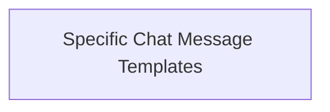

# specific_chat_message_templates

## Introduction

The `specific_chat_message_templates` module provides specialized prompt templates for creating AI and system messages within a chat context. These templates inherit from `_StringImageMessagePromptTemplate` and are designed to simplify the generation of structured chat messages for different roles (AI, System).

## Architecture

This module is a part of the `core_prompts.chat_prompt_templates` family and depends on `core_messages` for its underlying message classes (`AIMessage`, `SystemMessage`). It offers distinct templates for creating AI and System messages, ensuring clear role separation in conversational AI applications.

<!-- DIAGRAM_JSON
{
    "direction": "TD",
    "nodes": [
        {"id": "specific_chat_message_templates", "label": "Specific Chat Message Templates", "type": "module", "link": "specific_chat_message_templates.md"}
    ],
    "edges": [],
    "groups": []
}
-->

## Core Functionality

The `specific_chat_message_templates` module offers the following key components:

### AIMessagePromptTemplate

- **Purpose**: This class serves as a prompt template specifically for messages originating from the AI.
- **Details**: It inherits from `_StringImageMessagePromptTemplate` and internally uses the `AIMessage` class from `core_messages` to represent the AI's contribution to the chat. This ensures that AI-generated content is correctly attributed and processed within the larger chat system.

### SystemMessagePromptTemplate

- **Purpose**: This class provides a prompt template for system-level messages.
- **Details**: Inheriting from `_StringImageMessagePromptTemplate`, it uses the `SystemMessage` class from `core_messages`. System messages are typically not directly visible to the user but are crucial for providing context, instructions, or internal prompts to the AI model, influencing its behavior without being part of the direct conversational exchange.
