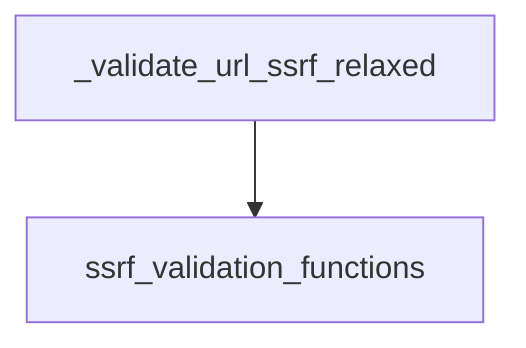

The `ssrf_relaxed_validation` module is a crucial component within the `core_security` framework, specifically designed to provide a flexible approach to Server-Side Request Forgery (SSRF) protection. It allows for the validation of URLs while permitting connections to private IP addresses and HTTP schemes, which can be necessary in certain controlled environments or for internal communications.

### Purpose and Core Functionality

The primary purpose of this module is to offer a less stringent URL validation mechanism compared to strict SSRF protection. Its core functionality revolves around the `_validate_url_ssrf_relaxed` function, which performs the following:

1.  **Type Checking**: Ensures the input `v` is a string before proceeding with validation.
2.  **Relaxed Validation**: Utilizes an underlying `validate_safe_url` function to check the URL's safety. Crucially, it sets `allow_private=True` to enable connections to private IP ranges (e.g., `10.0.0.0/8`, `172.16.0.0/12`, `192.168.0.0/16`, `127.0.0.0/8`) and `allow_http=True` to permit unencrypted HTTP connections. This allows for legitimate internal network access or specific use cases where private IPs and HTTP are intentionally allowed.

This relaxed validation is useful in scenarios where the application needs to interact with internal services or specific HTTP endpoints without triggering overly strict SSRF blocks, provided that appropriate security measures are in place to mitigate other risks.

### Architecture and Component Relationships

The `ssrf_relaxed_validation` module is a leaf module within the `core_security` tree. Its main component, `_validate_url_ssrf_relaxed`, directly depends on the `ssrf_validation_functions` module for the actual URL validation logic, specifically the `validate_safe_url` function.

<!-- DIAGRAM_JSON
{
    "direction": "TD",
    "nodes": [
        {"id": "validate_relaxed", "label": "_validate_url_ssrf_relaxed", "type": "component", "link": null},
        {"id": "ssrf_validation_functions", "label": "ssrf_validation_functions", "type": "external", "link": "ssrf_validation_functions.md"}
    ],
    "edges": [
        {"source": "validate_relaxed", "target": "ssrf_validation_functions"}
    ],
    "groups": []
}
-->

### System Integration

This module is integrated into the `core_security` system as part of the broader SSRF protection mechanisms. It provides an alternative to the more restrictive `ssrf_strict_validation` module, offering flexibility for different security contexts. Developers can choose to employ `ssrf_relaxed_validation` when internal network communication or specific HTTP access is required, understanding the implications of allowing private IP and HTTP connections.

It is typically invoked by higher-level modules that need to validate URLs provided by users or other external sources, where the risk assessment permits a more relaxed set of validation rules. Its placement under `ssrf_validation_functions` signifies its role as a specialized validation routine within the overall SSRF defense strategy.