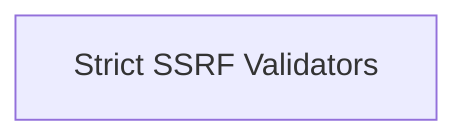

# ssrf_strict_validation Module Documentation

## Introduction

The `ssrf_strict_validation` module provides critical security functions for strictly validating URLs to prevent Server-Side Request Forgery (SSRF) attacks. It ensures that outgoing requests from the system only access trusted resources, with options for enforcing HTTPS-only connections.

## Architecture Overview

The module is structured around a core sub-module responsible for the actual validation logic. It integrates with the broader `core_security` module, specifically within the `ssrf_validation_functions` family.

<!-- DIAGRAM_JSON
{
    "direction": "TD",
    "nodes": [
        {"id": "strict_ssrf_validators", "label": "Strict SSRF Validators", "type": "module", "link": "strict_ssrf_validators.md"}
    ],
    "edges": [],
    "groups": []
}
-->

## Sub-modules

### [Strict SSRF Validators](strict_ssrf_validators.md)

This sub-module contains the core functions for performing strict URL validation to mitigate SSRF vulnerabilities. It includes utilities to check for private IP addresses and enforce HTTPS protocols.
