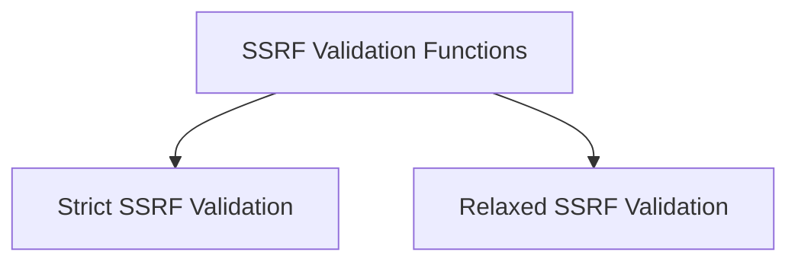

# SSRF Validation Functions Module

## Introduction

The `ssrf_validation_functions` module provides essential utilities for validating URLs to prevent Server-Side Request Forgery (SSRF) attacks. It offers different validation modes to accommodate various security requirements, from strict validation that disallows private IP ranges to more relaxed modes that permit them when necessary.

This module is a sub-component of `core_security`, focusing specifically on URL safety checks related to SSRF.

## Architecture Overview

The module is structured into two main sub-modules, each handling a distinct level of SSRF validation strictness:

<!-- DIAGRAM_JSON
{
    "direction": "TD",
    "nodes": [
        {"id": "ssrf_strict_validation", "label": "Strict SSRF Validation", "type": "module", "link": "ssrf_strict_validation.md"},
        {"id": "ssrf_relaxed_validation", "label": "Relaxed SSRF Validation", "type": "module", "link": "ssrf_relaxed_validation.md"}
    ],
    "edges": [
        {"source": "ssrf_strict_validation", "target": "ssrf_relaxed_validation"}
    ],
    "groups": []
}
-->

## Sub-modules

### [Strict SSRF Validation](ssrf_strict_validation.md)
This sub-module contains functions for strict URL validation. It disallows private IP ranges and offers options for validating URLs to allow both HTTP and HTTPS, or HTTPS only, providing robust protection against SSRF vulnerabilities.

### [Relaxed SSRF Validation](ssrf_relaxed_validation.md)
This sub-module provides functions for a more relaxed approach to URL validation. While still offering SSRF protection, it allows private IP ranges, which can be useful in specific internal network scenarios where such access is intentional and secure. 