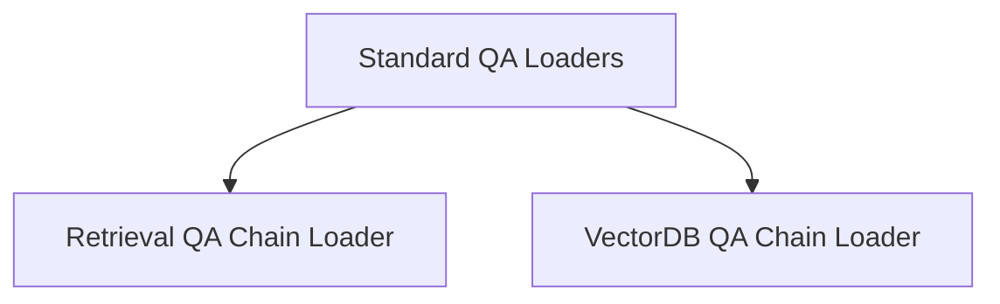

# Standard QA Loaders

The `standard_qa_loaders` module, a crucial part of the `classic_chains_loading` package, is responsible for facilitating the loading and configuration of common Question-Answering (QA) chains. It provides utilities to instantiate retrieval-based and vector database-based QA chains, integrating them with document combination logic.

## Architecture Overview

This module acts as an intermediary, taking configuration details and assembling complex QA chains. It relies on a retriever or a vector store to fetch relevant documents and then utilizes a separate document combination chain to process these documents and generate an answer. The module dynamically loads these combination chains either from a direct configuration or a specified path.

<!-- DIAGRAM_JSON
{
    "direction": "TD",
    "nodes": [
        {"id": "standard_qa_loaders_module", "label": "Standard QA Loaders", "type": "module"},
        {"id": "retrieval_qa_loader", "label": "Retrieval QA Chain Loader", "type": "module", "link": "retrieval_qa_loader.md"},
        {"id": "vector_db_qa_loader", "label": "VectorDB QA Chain Loader", "type": "module", "link": "vector_db_qa_loader.md"}
    ],
    "edges": [
        {"source": "standard_qa_loaders_module", "target": "retrieval_qa_loader"},
        {"source": "standard_qa_loaders_module", "target": "vector_db_qa_loader"}
    ],
    "groups": []
}
-->

## Sub-modules

### [Retrieval QA Chain Loader](retrieval_qa_loader.md)
Handles the loading and configuration of RetrievalQA chains, requiring a retriever and a document combination chain.

### [VectorDB QA Chain Loader](vector_db_qa_loader.md)
Manages the loading and configuration of VectorDBQA chains, requiring a vector store and a document combination chain.
