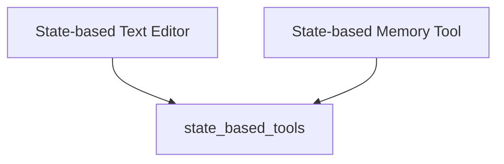

# state_based_tools Module Documentation

## Introduction

The `state_based_tools` module provides middleware for integrating Anthropic's state-based tools, such as `text_editor` and `memory`, into LangChain agents. These tools leverage LangGraph state for persistent file storage across conversation threads, enabling agents to maintain context and interact with editable files or memory within a conversational flow.

## Architecture Overview

This module contains middleware classes that wrap Anthropic's tools, allowing them to utilize LangGraph's state management for file persistence. The architecture is straightforward, with each middleware class responsible for a specific tool and managing its interaction with the shared state.

<!-- DIAGRAM_JSON
{
    "direction": "TD",
    "nodes": [
        {"id": "state_claude_text_editor_middleware", "label": "State-based Text Editor", "type": "module", "link": "state_claude_text_editor_middleware.md"},
        {"id": "state_claude_memory_middleware", "label": "State-based Memory Tool", "type": "module", "link": "state_claude_memory_middleware.md"}
    ],
    "edges": [
        {"source": "state_claude_text_editor_middleware", "target": "state_based_tools"},
        {"source": "state_claude_memory_middleware", "target": "state_based_tools"}
    ],
    "groups": []
}
-->

## Sub-modules

### [state_claude_text_editor_middleware](state_claude_text_editor_middleware.md)

This sub-module implements the `StateClaudeTextEditorMiddleware`, providing Anthropic's `text_editor` tool. It allows agents to interact with and modify text files that persist throughout the conversation, managed by the LangGraph state.

### [state_claude_memory_middleware](state_claude_memory_middleware.md)

This sub-module implements the `StateClaudeMemoryMiddleware`, offering Anthropic's memory tool. It uses LangGraph state for storage, ensuring that memory files persist across the conversation. It also enforces a `/memories` path prefix and injects a recommended system prompt for effective memory management.

