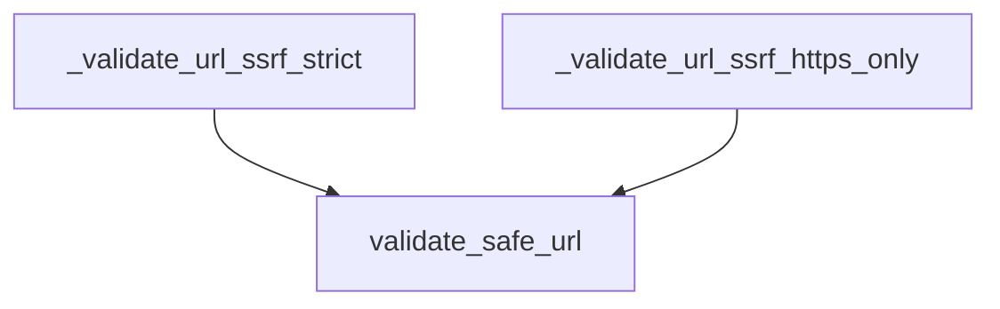

# strict_ssrf_validators

The `strict_ssrf_validators` module provides core functionalities for strictly validating URLs to prevent Server-Side Request Forgery (SSRF) attacks. It includes specialized functions for general strict URL validation and HTTPS-only strict URL validation.

## Architecture and Component Relationships

This module is a leaf module within the `core_security` component, specifically nested under `ssrf_strict_validation`. It encapsulates the direct implementation of strict SSRF validation logic by leveraging a common URL safety validation utility.

<!-- DIAGRAM_JSON
{
    "direction": "TD",
    "nodes": [
        {"id": "validate_strict", "label": "_validate_url_ssrf_strict", "type": "component", "link": null},
        {"id": "validate_https_only", "label": "_validate_url_ssrf_https_only", "type": "component", "link": null},
        {"id": "validate_safe_url", "label": "validate_safe_url", "type": "component", "link": null}
    ],
    "edges": [
        {"source": "validate_strict", "target": "validate_safe_url"},
        {"source": "validate_https_only", "target": "validate_safe_url"}
    ],
    "groups": []
}
-->

## Core Functionality

### `_validate_url_ssrf_strict(v: Any) -> Any`

This function performs strict URL validation for SSRF protection. If the input `v` is a string, it calls `validate_safe_url` with `allow_private=False` (disallowing private IP ranges) and `allow_http=True` (allowing both HTTP and HTTPS schemes). This ensures that only public, non-private URLs are considered safe, while still permitting HTTP connections.

### `_validate_url_ssrf_https_only(v: Any) -> Any`

This function provides an even stricter form of URL validation for SSRF protection, requiring HTTPS. If the input `v` is a string, it calls `validate_safe_url` with `allow_private=False` and `allow_http=False`. This configuration strictly enforces that URLs must use the HTTPS scheme and prevents connections to private IP ranges.

## How it Fits into the Overall System

The `strict_ssrf_validators` module is a crucial part of the [core_security](core_security.md) framework. It provides specific, hardened URL validation mechanisms used by other modules or components that handle external URL inputs, thereby mitigating the risk of SSRF vulnerabilities. It serves as a fundamental building block within the broader [ssrf_validation_functions](ssrf_validation_functions.md) system, ensuring that applications can safely interact with external resources by rigorously verifying the integrity and safety of URLs.
