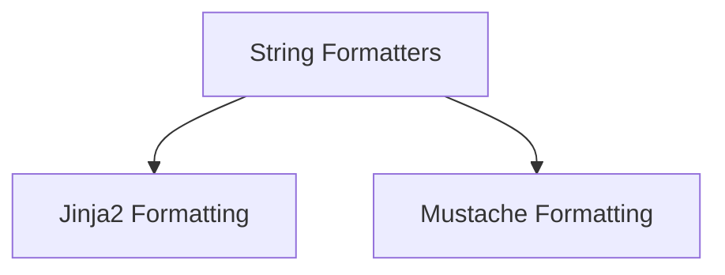

# String Formatters Module

The `string_formatters` module provides a collection of utilities for formatting strings using various templating engines. It offers flexible and powerful ways to dynamically generate content based on provided data.

## Architecture

This module is structured into specialized sub-modules, each focusing on a particular string formatting mechanism. The current architecture includes:

*   **Jinja2 Formatting**: For advanced templating with security considerations.
*   **Mustache Formatting**: For simple, logic-less templating.

These sub-modules are designed to be independent but work together under the `string_formatters` umbrella to offer a comprehensive set of string manipulation tools.

<!-- DIAGRAM_JSON
{
    "direction": "TD",
    "nodes": [
        {"id": "string_formatters", "label": "String Formatters", "type": "module"},
        {"id": "jinja2_formatting", "label": "Jinja2 Formatting", "type": "module", "link": "jinja2_formatting.md"},
        {"id": "mustache_formatting", "label": "Mustache Formatting", "type": "module", "link": "mustache_formatting.md"}
    ],
    "edges": [
        {"source": "string_formatters", "target": "jinja2_formatting"},
        {"source": "string_formatters", "target": "mustache_formatting"}
    ],
    "groups": []
}
-->

## Sub-modules

### [Jinja2 Formatting](jinja2_formatting.md)

This sub-module focuses on leveraging the Jinja2 templating engine for string formatting. It includes robust functionality for rendering templates while also highlighting important security considerations related to arbitrary code execution.

### [Mustache Formatting](mustache_formatting.md)

The `mustache_formatting` sub-module provides capabilities for formatting strings using the Mustache templating syntax. It is designed for straightforward, logic-less templating, offering a simple way to inject data into predefined templates.