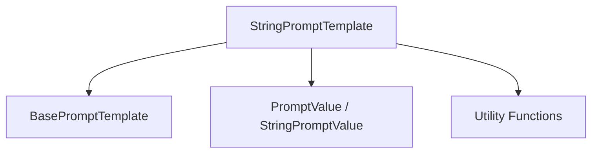

# String Prompt Templates

The `string_prompt_templates` module provides a foundational abstract class, `StringPromptTemplate`, for creating prompt templates that output a simple string. This module is essential for defining how input variables are formatted into a coherent string prompt, which can then be used by language models.

## Module Architecture

The `string_prompt_templates` module primarily consists of the `StringPromptTemplate` abstract base class. It extends `BasePromptTemplate` and defines the core interface for string-based prompt formatting.

<!-- DIAGRAM_JSON
{
    "direction": "TD",
    "nodes": [
        {"id": "StringPromptTemplate", "label": "StringPromptTemplate", "type": "component", "link": null},
        {"id": "BasePromptTemplate", "label": "BasePromptTemplate", "type": "external", "link": "base_prompt_template_core.md"},
        {"id": "PromptValue", "label": "PromptValue / StringPromptValue", "type": "external", "link": "core_prompt_values.md"},
        {"id": "UtilityFunctions", "label": "Utility Functions", "type": "external", "link": "core_utils.md"}
    ],
    "edges": [
        {"source": "StringPromptTemplate", "target": "BasePromptTemplate"},
        {"source": "StringPromptTemplate", "target": "PromptValue"},
        {"source": "StringPromptTemplate", "target": "UtilityFunctions"}
    ],
    "groups": []
}
-->

## Core Components

### `StringPromptTemplate`

`libs.core.langchain_core.prompts.string.StringPromptTemplate`

This is an abstract base class that provides a standardized interface for prompt templates that render into a string. It inherits from `BasePromptTemplate` and introduces methods for both synchronous and asynchronous formatting, along with utility methods for representation and printing.

**Key Methods:**

- **`get_lc_namespace(cls) -> list[str]`**
    - Returns the LangChain namespace for this object, which is `["langchain", "prompts", "base"]`.

- **`format_prompt(self, **kwargs: Any) -> PromptValue`**
    - Formats the prompt using the provided keyword arguments and returns a `StringPromptValue` instance. This method internally calls the abstract `format` method.
    - For more details on `PromptValue` and `StringPromptValue`, refer to the [core_prompt_values documentation](core_prompt_values.md).

- **`aformat_prompt(self, **kwargs: Any) -> PromptValue`**
    - Asynchronously formats the prompt using the provided keyword arguments and returns a `StringPromptValue` instance. This method internally calls the abstract `aformat` method.

- **`format(self, **kwargs: Any) -> str` (Abstract Method)**
    - This is an abstract method that concrete implementations of `StringPromptTemplate` must override. It defines how the input variables (`kwargs`) are transformed into the final string prompt.

- **`pretty_repr(self, html: bool = False) -> str`**
    - Generates a human-readable representation of the prompt, substituting input variables with dummy placeholders. If `html` is `True`, the output may include HTML formatting.
    - This method utilizes utility functions like `get_colored_text` from the [core_utils module](core_utils.md) for enhanced output in interactive environments.

- **`pretty_print(self) -> None`**
    - Prints a pretty representation of the prompt to the console. It uses the `pretty_repr` method and checks if the environment is interactive via `is_interactive_env` from the [core_utils module](core_utils.md).

## Relationships to Other Modules

- **`base_prompt_template_core`**: `StringPromptTemplate` inherits from `BasePromptTemplate`, establishing a fundamental relationship with the core prompt template definitions.
- **`core_prompt_values`**: The `format_prompt` and `aformat_prompt` methods return instances of `PromptValue`, specifically `StringPromptValue`, linking this module to the prompt value representation.
- **`core_utils`**: Utility functions like `get_colored_text` and `is_interactive_env` are used for pretty printing and representation, indicating a dependency on general utility functions.
