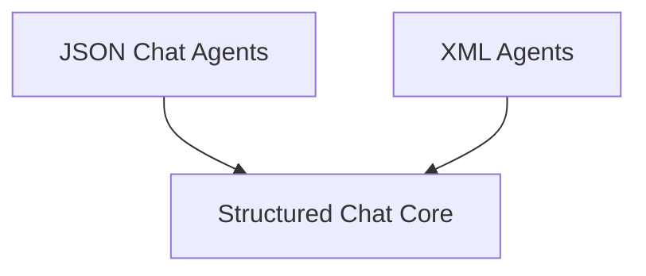

# Structured Agents Module

The `structured_agents` module provides a foundational framework for developing agents that interact with large language models using structured data formats like JSON and XML. It offers various agent types and utilities to handle complex conversational flows, tool utilization, and structured output parsing.

## Architecture Overview

The `structured_agents` module is composed of several key sub-modules, each responsible for a specific aspect of structured agent functionality:

<!-- DIAGRAM_JSON
{
    "direction": "TD",
    "nodes": [
        {"id": "json_chat_agents", "label": "JSON Chat Agents", "type": "module", "link": "json_chat_agents.md"},
        {"id": "structured_chat_core", "label": "Structured Chat Core", "type": "module", "link": "structured_chat_core.md"},
        {"id": "xml_agents", "label": "XML Agents", "type": "module", "link": "xml_agents.md"}
    ],
    "edges": [
        {"source": "json_chat_agents", "target": "structured_chat_core"},
        {"source": "xml_agents", "target": "structured_chat_core"}
    ],
    "groups": []
}
-->

## Sub-modules

### [JSON Chat Agents](json_chat_agents.md)
This sub-module focuses on creating agents that communicate and operate using JSON formatted messages, specifically tailored for chat models. It includes utilities for defining agent logic and handling JSON input/output.

### [Structured Chat Core](structured_chat_core.md)
This sub-module provides the core components for building structured chat agents. It encompasses the fundamental `StructuredChatAgent` class, functions for agent creation, and advanced output parsing mechanisms, including retry strategies for robust interactions.

### [XML Agents](xml_agents.md)
This sub-module is dedicated to agents that leverage XML for their operational logic and communication. It offers classes and functions to define and create XML-based agents, enabling structured interactions through XML tags.