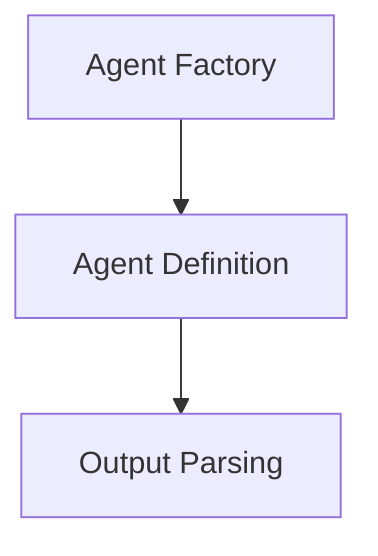

# Structured Chat Core Module

The `structured_chat_core` module provides the foundational components for building agents that interact with users and tools in a structured, conversational manner. It defines how structured chat agents are constructed, how they parse outputs from language models, and offers utilities for their creation.

## Architecture Overview

The `structured_chat_core` module is composed of three main sub-modules:

1.  **Agent Definition (`agent_definition.md`)**: Defines the fundamental `StructuredChatAgent` class, which serves as the blueprint for structured chat agents.
2.  **Agent Factory (`agent_factory.md`)**: Offers a convenient function for instantiating structured chat agents with appropriate configurations.
3.  **Output Parsing (`output_parsing.md`)**: Handles the crucial task of interpreting the structured output generated by the language model, including retry mechanisms for error robustness.

These components work together to enable agents to understand tool specifications, generate structured responses, and gracefully handle parsing errors, ensuring reliable and effective structured conversations.

<!-- DIAGRAM_JSON
{
    "direction": "TD",
    "nodes": [
        {"id": "agent_definition", "label": "Structured Chat Agent Definition", "type": "module", "link": "agent_definition.md"},
        {"id": "agent_factory", "label": "Structured Chat Agent Factory", "type": "module", "link": "agent_factory.md"},
        {"id": "output_parsing", "label": "Structured Chat Output Parsing", "type": "module", "link": "output_parsing.md"}
    ],
    "edges": [
        {"source": "agent_factory", "target": "agent_definition"},
        {"source": "agent_definition", "target": "output_parsing"}
    ],
    "groups": []
}
-->
