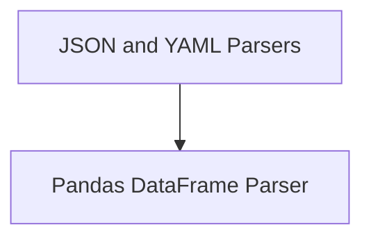

# Structured Data Parsers Module Documentation

## Introduction

The `structured_data_parsers` module provides a suite of tools designed to parse and extract structured information from the output of Language Model (LLM) calls. It facilitates the conversion of free-form text into predictable data formats such as JSON, YAML, or directly manipulable Pandas DataFrames, ensuring that LLM responses can be reliably integrated into downstream applications.

## Architecture Overview

The module is composed of distinct sub-modules, each specializing in a particular type of structured data parsing. The design emphasizes clear separation of concerns, allowing for flexible and extensible parsing capabilities.

<!-- DIAGRAM_JSON
{
    "direction": "TD",
    "nodes": [
        {"id": "json_and_yaml_parsers", "label": "JSON and YAML Parsers", "type": "module", "link": "json_and_yaml_parsers.md"},
        {"id": "dataframe_parser", "label": "Pandas DataFrame Parser", "type": "module", "link": "dataframe_parser.md"}
    ],
    "edges": [
        {"source": "json_and_yaml_parsers", "target": "dataframe_parser"}
    ],
    "groups": []
}
-->

## Sub-modules

### [JSON and YAML Parsers](json_and_yaml_parsers.md)
This sub-module contains parsers responsible for converting LLM output into structured JSON or YAML formats. It includes `StructuredOutputParser` for JSON parsing based on response schemas and `YamlOutputParser` for parsing YAML using Pydantic models.

### [Pandas DataFrame Parser](dataframe_parser.md)
This sub-module offers a specialized parser, `PandasDataFrameOutputParser`, which is designed to extract and manipulate data from LLM output directly into a Pandas DataFrame. It provides functionalities for querying and filtering DataFrame content based on parsed requests.