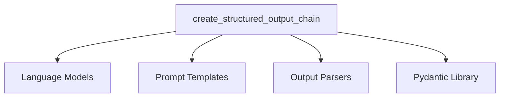

# structured_output_generation Module

The `structured_output_generation` module provides a specialized function for creating language model chains that leverage OpenAI's function-calling capabilities to produce structured outputs. This is particularly useful for tasks requiring information extraction, data structuring, or converting free-form text into predefined formats (e.g., JSON, Pydantic models).

### Purpose and Core Functionality

The primary purpose of this module is to simplify the process of defining and executing LLM calls that yield predictable and structured results. It abstracts away the complexities of crafting OpenAI function definitions and integrating them with prompt templates and output parsing logic.

The core functionality is encapsulated in the `create_structured_output_chain` function:

*   **Structured Output Definition**: Allows developers to define the desired output structure using either a Python dictionary (representing a JSON schema) or a Pydantic `BaseModel`. Using Pydantic models is encouraged for better type hinting, validation, and automatic documentation of the schema.
*   **LLM Integration**: Seamlessly integrates with language models that support the OpenAI function-calling API, enabling the model to generate outputs conforming to the specified structure.
*   **Prompt Customization**: Accepts `BasePromptTemplate` instances, providing flexibility in guiding the language model's behavior and the context for structured output generation.
*   **Automatic Output Parsing**: Automatically infers or allows explicit specification of output parsers. When a Pydantic `BaseModel` is used, it defaults to a `PydanticAttrOutputFunctionsParser` to convert the model's output into Pydantic instances, ensuring type safety and ease of use.

### Architecture and Component Relationships

The `structured_output_generation` module is a leaf module, containing a single core component, `create_structured_output_chain`. This function orchestrates the creation of an `LLMChain` by leveraging several external dependencies.

<!-- DIAGRAM_JSON
{
    "direction": "TD",
    "nodes": [
        {"id": "create_structured_output_chain", "label": "create_structured_output_chain", "type": "component", "link": null},
        {"id": "llm_dependency", "label": "Language Models", "type": "external", "link": "core_language_models.md"},
        {"id": "prompt_dependency", "label": "Prompt Templates", "type": "external", "link": "core_prompts.md"},
        {"id": "output_parser_dependency", "label": "Output Parsers", "type": "external", "link": "core_output_parsers.md"},
        {"id": "pydantic_dependency", "label": "Pydantic Library", "type": "external", "link": null}
    ],
    "edges": [
        {"source": "create_structured_output_chain", "target": "llm_dependency"},
        {"source": "create_structured_output_chain", "target": "prompt_dependency"},
        {"source": "create_structured_output_chain", "target": "output_parser_dependency"},
        {"source": "create_structured_output_chain", "target": "pydantic_dependency"}
    ],
    "groups": []
}
-->

**Component Breakdown:**

*   **`create_structured_output_chain`**: This is the central function. It takes an `output_schema` (either a dictionary or a Pydantic `BaseModel`), an `llm` (from `core_language_models`), and a `prompt` (from `core_prompts`). It internally defines the OpenAI function structure based on the `output_schema` and, if a Pydantic model is used, configures a `PydanticAttrOutputFunctionsParser` (from `core_output_parsers`) to handle the output. Finally, it delegates to an internal `create_openai_fn_chain` (part of the broader `classic_chains_openai_functions` module) to construct and return the `LLMChain`.

**External Dependencies:**

*   **[Language Models](core_language_models.md)**: Provides the `BaseLanguageModel` interface, which is implemented by various LLM integrations. The `create_structured_output_chain` function requires an LLM capable of using OpenAI's function-calling API.
*   **[Prompt Templates](core_prompts.md)**: Supplies the `BasePromptTemplate` class, allowing for flexible construction of prompts that guide the LLM in generating structured output.
*   **[Output Parsers](core_output_parsers.md)**: Crucial for converting the raw output from the LLM into the desired structured format. Specifically, `PydanticAttrOutputFunctionsParser` is used when a Pydantic `BaseModel` defines the output schema.
*   **Pydantic Library**: An external library that provides data validation and settings management using Python type hints. It is extensively used to define the structure of the desired output.

### Integration with Overall System

The `structured_output_generation` module is a sub-module of `classic_chains_openai_functions`. This placement signifies its role as a specialized utility within the broader `classic_chains_openai_functions` module, which focuses on creating various types of chains that leverage OpenAI's function-calling capabilities.

It provides a high-level abstraction for a common use case: generating structured data using LLMs. By doing so, it contributes to the versatility and ease of use of the classic LangChain framework, particularly for applications requiring reliable and formatted data extraction or generation. Developers can integrate the chains created by this module into larger applications, combining them with other chains or components for more complex workflows.