# Structured Parsers
This module provides a collection of specialized output parsers for converting raw language model outputs into structured formats such as XML, datetime objects, enums, Pandas DataFrame operations, generic JSON/YAML structures, and tool calls.
<!-- DIAGRAM_JSON
{
    "direction": "TD",
    "nodes": [
        {"id": "xml_parser", "label": "XML Output Parser", "type": "component", "link": null},
        {"id": "datetime_parser", "label": "Datetime Output Parser", "type": "component", "link": null},
        {"id": "enum_parser", "label": "Enum Output Parser", "type": "component", "link": null},
        {"id": "pandas_parser", "label": "Pandas DataFrame Output Parser", "type": "component", "link": null},
        {"id": "structured_parser", "label": "Structured JSON Output Parser", "type": "component", "link": null},
        {"id": "yaml_parser", "label": "YAML Output Parser (Pydantic)", "type": "component", "link": null},
        {"id": "tools_parser", "label": "Tools Output Parser (Anthropic)", "type": "component", "link": null},
        {"id": "base_parsers_mod", "label": "Base Parsers", "type": "external", "link": "base_parsers.md"},
        {"id": "core_utilities_mod", "label": "Core Utilities (Pydantic)", "type": "external", "link": "core_utilities.md"},
        {"id": "libs_partners_anthropic_mod", "label": "Anthropic Partner Integration", "type": "external", "link": "libs_partners_anthropic.md"}
    ],
    "edges": [
        {"source": "xml_parser", "target": "base_parsers_mod", "label": "inherits from"},
        {"source": "datetime_parser", "target": "base_parsers_mod", "label": "inherits from"},
        {"source": "enum_parser", "target": "base_parsers_mod", "label": "inherits from"},
        {"source": "pandas_parser", "target": "base_parsers_mod", "label": "inherits from"},
        {"source": "structured_parser", "target": "base_parsers_mod", "label": "inherits from"},
        {"source": "yaml_parser", "target": "base_parsers_mod", "label": "inherits from"},
        {"source": "tools_parser", "target": "base_parsers_mod", "label": "inherits from"},
        {"source": "yaml_parser", "target": "core_utilities_mod", "label": "uses Pydantic from"},
        {"source": "tools_parser", "target": "core_utilities_mod", "label": "uses Pydantic from"},
        {"source": "tools_parser", "target": "libs_partners_anthropic_mod", "label": "part of"}
    ],
    "groups": [
        {"id": "structured_output_parsing", "label": "Structured Output Parsing", "role": "analytical", "nodes": ["xml_parser", "datetime_parser", "enum_parser", "pandas_parser", "structured_parser", "yaml_parser", "tools_parser"]}
    ]
}
-->

```mermaid
flowchart TD
    subgraph structured_output_parsing["Structured Output Parsing"]
        xml_parser["XML Output Parser"]
        datetime_parser["Datetime Output Parser"]
        enum_parser["Enum Output Parser"]
        pandas_parser["Pandas DataFrame Output Parser"]
        structured_parser["Structured JSON Output Parser"]
        yaml_parser["YAML Output Parser (Pydantic)"]
        tools_parser["Tools Output Parser (Anthropic)"]
    end

    base_parsers_mod["Base Parsers"]
    core_utilities_mod["Core Utilities (Pydantic)"]
    libs_partners_anthropic_mod["Anthropic Partner Integration"]

    xml_parser -.->|'''inherits from'''| base_parsers_mod
    datetime_parser -.->|'''inherits from'''| base_parsers_mod
    enum_parser -.->|'''inherits from'''| base_parsers_mod
    pandas_parser -.->|'''inherits from'''| base_parsers_mod
    structured_parser -.->|'''inherits from'''| base_parsers_mod
    yaml_parser -.->|'''inherits from'''| base_parsers_mod
    tools_parser -.->|'''inherits from'''| base_parsers_mod

    yaml_parser -->|'''uses Pydantic from'''| core_utilities_mod
    tools_parser -->|'''uses Pydantic from'''| core_utilities_mod

    tools_parser -->|'''part of'''| libs_partners_anthropic_mod

    classDef analytical fill:#ede9fe,stroke:#8b5cf6,stroke-width:1px,color:#4c1d95
    classDef external fill:#dbeafe,stroke:#3b82f6,stroke-width:2px,color:#1e3a5f

    class xml_parser,datetime_parser,enum_parser,pandas_parser,structured_parser,yaml_parser,tools_parser analytical
    class base_parsers_mod,core_utilities_mod,libs_partners_anthropic_mod external

    click base_parsers_mod "base_parsers.md" "View Base Parsers Module"
    click core_utilities_mod "core_utilities.md" "View Core Utilities Module"
    click libs_partners_anthropic_mod "libs_partners_anthropic.md" "View Anthropic Partner Integration Module"
```
