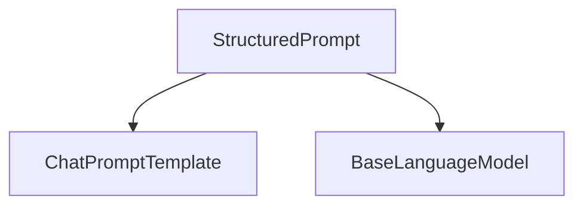

# Structured Prompts Module

The `structured_prompts` module provides the `StructuredPrompt` class, a specialized prompt template designed to work with language models to elicit structured outputs. It extends the functionality of standard chat prompt templates by enforcing a predefined schema for the model's response.

## Core Functionality

The primary component of this module is the `StructuredPrompt` class.

### `StructuredPrompt`

`StructuredPrompt` is a powerful tool for guiding language models to produce outputs that conform to a specific data structure, such as a Pydantic model or a dictionary schema. This is crucial for applications that require reliable and parsable responses from language models.

**Key Features:**

-   **Schema Enforcement**: Requires a `schema_` (either a dictionary or a Pydantic `BaseModel`) to define the expected output format.
-   **Inheritance**: Extends `ChatPromptTemplate` from the [core_prompts](core_prompts.md) module, inheriting its message handling capabilities.
-   **Piping to Language Models**: Designed to be piped directly to language models that support structured output, such as those with a `with_structured_output` method.

**Initialization and Usage:**

To create a `StructuredPrompt`, you must provide a sequence of messages and a schema. The `schema_` is mandatory and ensures that the prompt is always geared towards structured output.

```python
from langchain_core.prompts import StructuredPrompt
from pydantic import BaseModel

class OutputSchema(BaseModel):
    name: str
    value: int

template = StructuredPrompt(
    [
        ("human", "Extract the name and a numerical value from the following text: {text}"),
        ("ai", "```json
{{\"name\": \"example\", \"value\": 123}}
```"),
    ],
    OutputSchema,
)

# Example of piping to a language model (assuming `llm` is a BaseLanguageModel instance)
# structured_output_chain = template | llm
```

The `from_messages_and_schema` class method provides a convenient way to instantiate `StructuredPrompt`.

## Architecture and Component Relationships

The `structured_prompts` module, specifically the `StructuredPrompt` component, plays a vital role in enabling structured interactions with language models. It builds upon existing prompt infrastructure and interacts with language model interfaces.

<!-- DIAGRAM_JSON
{
    "direction": "TD",
    "nodes": [
        {"id": "structured_prompt", "label": "StructuredPrompt", "type": "component", "link": null},
        {"id": "chat_prompt_template", "label": "ChatPromptTemplate", "type": "external", "link": "core_prompts.md"},
        {"id": "base_language_model", "label": "BaseLanguageModel", "type": "external", "link": "core_language_models.md"}
    ],
    "edges": [
        {"source": "structured_prompt", "target": "chat_prompt_template"},
        {"source": "structured_prompt", "target": "base_language_model"}
    ],
    "groups": []
}
-->


### Relationships:

-   **`StructuredPrompt`** inherits from and utilizes `ChatPromptTemplate` from the [core_prompts](core_prompts.md) module, leveraging its foundational capabilities for managing and formatting conversational prompts.
-   **`StructuredPrompt`** interacts with `BaseLanguageModel` from the [core_language_models](core_language_models.md) module. Specifically, its `pipe` method is designed to integrate with language models that offer structured output capabilities (e.g., `with_structured_output`), ensuring that the model's response adheres to the defined schema.

## Integration with the Overall System

The `structured_prompts` module is a critical component for building applications that require predictable and machine-readable outputs from large language models. By enforcing a schema, it streamlines downstream processing, reduces parsing errors, and enhances the reliability of AI-powered workflows.

It serves as an intermediary layer, taking a user's request and a desired output structure, and then preparing a prompt that guides the language model to generate output conforming to that structure. This makes it an essential building block for agents, data extraction systems, and any application where the output format is crucial for subsequent operations.