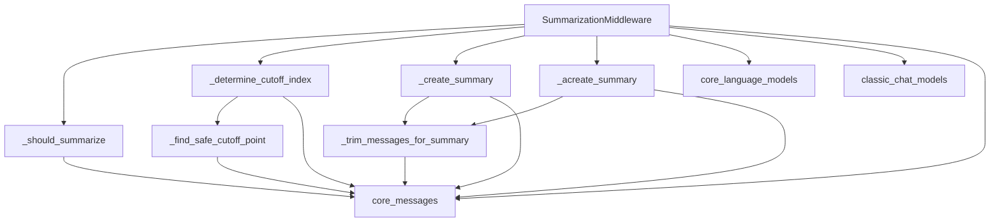

# Summarization Module

## Introduction

The `summarization` module, specifically through its `SummarizationMiddleware` component, is designed to intelligently manage conversation history within agent-based systems. Its primary purpose is to prevent context window overflow by automatically summarizing older messages when token limits are approached. This ensures that the agent always has access to the most relevant recent conversation while maintaining a concise understanding of past interactions.

## Core Functionality

The `SummarizationMiddleware` acts as a crucial pre-processing step before a language model is invoked. It monitors the length of the message history, both in terms of message count and token count, and triggers summarization based on configurable thresholds. Key functionalities include:

*   **Automatic Summarization**: Reduces the length of conversation history by generating a concise summary of older messages.
*   **Context Preservation**: Prioritizes keeping recent messages intact and ensures that related AI and Tool messages are never separated during the trimming process.
*   **Configurable Triggers**: Allows defining thresholds for summarization based on message count, token count, or a fraction of the model's maximum input tokens.
*   **Retention Policy**: Specifies how much of the most recent conversation history should be preserved after summarization.
*   **Asynchronous Support**: Provides both synchronous and asynchronous methods for message processing and summary generation.

## Architecture and Component Relationships

The `SummarizationMiddleware` integrates with language models and message utilities to perform its function. Below is a diagram illustrating its internal components and external dependencies.

<!-- DIAGRAM_JSON
{
    "direction": "TD",
    "nodes": [
        {"id": "summarization_middleware", "label": "SummarizationMiddleware", "type": "component", "link": null},
        {"id": "should_summarize", "label": "_should_summarize", "type": "component", "link": null},
        {"id": "determine_cutoff_index", "label": "_determine_cutoff_index", "type": "component", "link": null},
        {"id": "create_summary", "label": "_create_summary", "type": "component", "link": null},
        {"id": "acreate_summary", "label": "_acreate_summary", "type": "component", "link": null},
        {"id": "trim_messages_for_summary", "label": "_trim_messages_for_summary", "type": "component", "link": null},
        {"id": "find_safe_cutoff_point", "label": "_find_safe_cutoff_point", "type": "component", "link": null},
        {"id": "core_language_models", "label": "core_language_models", "type": "external", "link": "core_language_models.md"},
        {"id": "classic_chat_models", "label": "classic_chat_models", "type": "external", "link": "classic_chat_models.md"},
        {"id": "core_messages", "label": "core_messages", "type": "external", "link": "core_messages.md"}
    ],
    "edges": [
        {"source": "summarization_middleware", "target": "should_summarize"},
        {"source": "summarization_middleware", "target": "determine_cutoff_index"},
        {"source": "summarization_middleware", "target": "create_summary"},
        {"source": "summarization_middleware", "target": "acreate_summary"},
        {"source": "create_summary", "target": "trim_messages_for_summary"},
        {"source": "acreate_summary", "target": "trim_messages_for_summary"},
        {"source": "determine_cutoff_index", "target": "find_safe_cutoff_point"},
        {"source": "summarization_middleware", "target": "core_language_models"},
        {"source": "summarization_middleware", "target": "classic_chat_models"},
        {"source": "summarization_middleware", "target": "core_messages"},
        {"source": "should_summarize", "target": "core_messages"},
        {"source": "determine_cutoff_index", "target": "core_messages"},
        {"source": "create_summary", "target": "core_messages"},
        {"source": "acreate_summary", "target": "core_messages"},
        {"source": "trim_messages_for_summary", "target": "core_messages"},
        {"source": "find_safe_cutoff_point", "target": "core_messages"}
    ],
    "groups": []
}
-->

### Component Descriptions

*   **`SummarizationMiddleware`**: The main class that orchestrates the summarization process. It initializes with a language model, summarization triggers, and retention policies. It intercepts messages before they are sent to the model (`before_model` and `abefore_model` methods) to apply summarization if necessary.
*   **`_should_summarize`**: A private method that evaluates whether summarization is needed based on the current message count, token count, and the configured `trigger` conditions.
*   **`_determine_cutoff_index`**: Determines the exact point in the message history where the conversation should be cut for summarization, respecting the `keep` policy and ensuring logical message groupings (e.g., not splitting AI/Tool message pairs).
*   **`_create_summary` / `_acreate_summary`**: Methods responsible for generating the actual summary of the `messages_to_summarize` using the configured language model and `summary_prompt`. `_acreate_summary` is the asynchronous version.
*   **`_trim_messages_for_summary`**: Pre-processes the messages intended for summarization, trimming them further if the `trim_tokens_to_summarize` limit is set, to ensure the summarization call itself doesn't exceed the model's context window.
*   **`_find_safe_cutoff_point`**: Ensures that the message history is not split in a way that separates an `AIMessage` from its corresponding `ToolMessage` responses, maintaining conversational coherence.

## Integration with the Overall System

The `summarization` module is a sub-module of `langchain_v1_agents_middleware`, indicating its role as a middleware component within the LangChain V1 agent framework. It sits within the chain of processing steps that an agent's input messages undergo before reaching the underlying language model.

*   **Agent Middleware**: As a middleware, it transparently intercepts and modifies the agent's state (specifically the `messages` attribute) to manage context. This allows agents to handle longer conversations without manually managing history or token limits.
*   **Language Models**: It depends on `BaseChatModel` from [core_language_models](core_language_models.md) (or an initialized model via `init_chat_model` from [classic_chat_models](classic_chat_models.md)) to perform the actual summarization task.
*   **Message Handling**: It interacts heavily with message types (e.g., `HumanMessage`, `AIMessage`, `ToolMessage`) and token counting utilities from the [core_messages](core_messages.md) module to accurately assess conversation length and reconstruct the message history.

This module plays a critical role in enabling robust and long-running conversations for LangChain V1 agents by automating context management and preventing common context window issues.