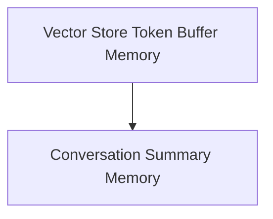

# Summary and Vector Memory Module

This module provides advanced memory management functionalities for conversational AI systems, combining summarization techniques with vector store capabilities. It enables intelligent handling of conversation history, ensuring that the AI has access to relevant context while managing token limits efficiently.

## Architecture Overview

The `summary_and_vector_memory` module is composed of two primary sub-modules:
- `summary_memory`: Focuses on various strategies for summarizing conversation history.
- `vector_store_memory`: Integrates vector stores to provide long-term memory and retrieve relevant past interactions based on semantic similarity, while also managing token usage.

These sub-modules work together to offer a comprehensive memory solution that can adapt to different conversational needs.

<!-- DIAGRAM_JSON
{
    "direction": "TD",
    "nodes": [
        {"id": "summary_memory", "label": "Conversation Summary Memory", "type": "module", "link": "summary_memory.md"},
        {"id": "vector_store_memory", "label": "Vector Store Token Buffer Memory", "type": "module", "link": "vector_store_memory.md"}
    ],
    "edges": [
        {"source": "vector_store_memory", "target": "summary_memory"}
    ],
    "groups": []
}
-->

## Sub-modules

### [Conversation Summary Memory](summary_memory.md)
This sub-module is responsible for abstracting the summarization logic for conversation history. It includes implementations for continually summarizing conversations and maintaining a summary buffer while adhering to token limits.

### [Vector Store Token Buffer Memory](vector_store_memory.md)
This sub-module provides conversation memory with a token limit, backed by a vector store. It intelligently stores and retrieves past interactions, allowing for a more dynamic and scalable memory solution that leverages semantic search capabilities. It also incorporates timestamping for better context management. 