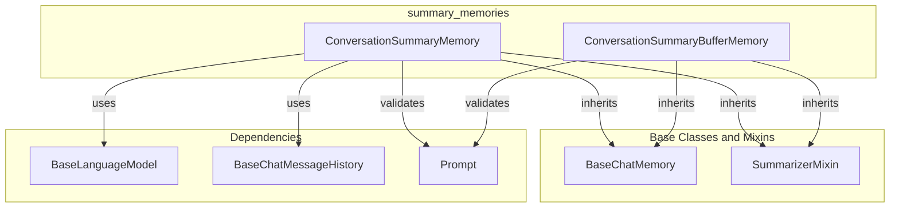

# summary_memories
This module provides memory components that summarize conversation history, either continually or by buffering recent messages within a token limit.

<!-- DIAGRAM_JSON
{
  "nodes": [
    {"id": "CSM", "label": "ConversationSummaryMemory", "type": "class"},
    {"id": "CSBM", "label": "ConversationSummaryBufferMemory", "type": "class"},
    {"id": "BCM", "label": "BaseChatMemory", "type": "base_class"},
    {"id": "SM", "label": "SummarizerMixin", "type": "mixin"},
    {"id": "BLM", "label": "BaseLanguageModel", "type": "dependency"},
    {"id": "BCMH", "label": "BaseChatMessageHistory", "type": "dependency"},
    {"id": "P", "label": "Prompt", "type": "dependency"}
  ],
  "edges": [
    {"source": "CSM", "target": "BCM", "label": "inherits"},
    {"source": "CSM", "target": "SM", "label": "inherits"},
    {"source": "CSM", "target": "BLM", "label": "uses"},
    {"source": "CSM", "target": "BCMH", "label": "uses"},
    {"source": "CSM", "target": "P", "label": "validates"},
    {"source": "CSBM", "target": "BCM", "label": "inherits"},
    {"source": "CSBM", "target": "SM", "label": "inherits"},
    {"source": "CSBM", "target": "P", "label": "validates"}
  ],
  "groups": [
    {"id": "summary_memories", "label": "summary_memories", "nodes": ["CSM", "CSBM"]},
    {"id": "base_classes_mixins", "label": "Base Classes & Mixins", "nodes": ["BCM", "SM"]},
    {"id": "dependencies", "label": "Dependencies", "nodes": ["BLM", "BCMH", "P"]}
  ]
}
-->
