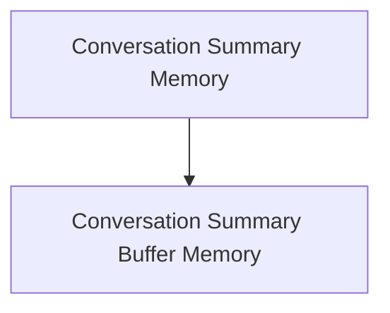

# Summary Memory Module Documentation

The `summary_memory` module provides crucial components for managing and summarizing conversational history within the system. It offers mechanisms to either continually summarize conversations or maintain a summary buffer, ensuring that interactions remain contextually relevant without exceeding specified token limits.

## Architecture Overview

The `summary_memory` module is composed of two primary sub-modules, each addressing a specific approach to conversation summarization:

<!-- DIAGRAM_JSON
{
    "direction": "TD",
    "nodes": [
        {"id": "conversation_summary_memory", "label": "Conversation Summary Memory", "type": "module", "link": "conversation_summary_memory.md"},
        {"id": "conversation_summary_buffer_memory", "label": "Conversation Summary Buffer Memory", "type": "module", "link": "conversation_summary_buffer_memory.md"}
    ],
    "edges": [
        {"source": "conversation_summary_memory", "target": "conversation_summary_buffer_memory"}
    ],
    "groups": []
}
-->

## Sub-modules

### [Conversation Summary Memory](conversation_summary_memory.md)
This module provides a memory component that continually summarizes the conversation history, updating the summary after each turn to provide context.

### [Conversation Summary Buffer Memory](conversation_summary_buffer_memory.md)
This module offers a memory buffer that maintains a running summary of the conversation and recent messages, ensuring the total token count does not exceed a specified limit.