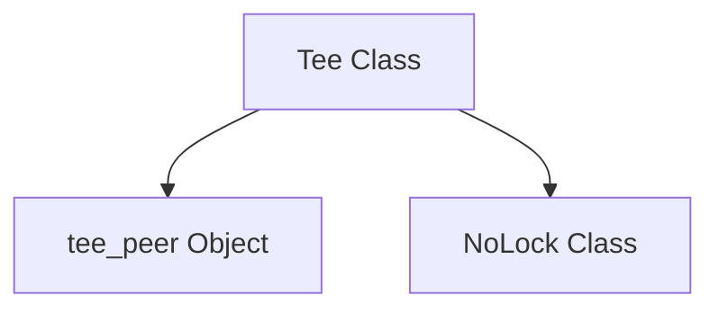

# synchronous_iterator_tee Module Documentation
The `synchronous_iterator_tee` module provides the `Tee` class, a utility for splitting a single synchronous iterable into multiple independent synchronous iterators. This is particularly useful when you need to consume the same data stream multiple times without re-fetching or re-processing the original source.

## Core Functionality

### `Tee` Class

The `Tee` class enables the creation of `n` separate iterators from a single source iterable. Each child iterator can advance independently, yet all share the same items from the original `iterable` in the same order.

**Key Features:**

*   **Lazy Evaluation**: The `Tee` class operates lazily, fetching items from the source iterable only when needed by the most advanced child iterator. This makes it suitable for handling infinite iterables.
*   **Shared Buffering**: Items are buffered internally until the least advanced child iterator has yielded them. This ensures all iterators receive the complete sequence of items.
*   **Custom Type**: Unlike `itertools.tee`, this `Tee` returns a custom type that allows for easy access to child iterators via indexing or iteration, and provides a `close` method to immediately terminate all child iterators. It also supports the `with` statement for automatic cleanup.
*   **Concurrency Safety**: While primarily designed for synchronous use, if the underlying iterable is concurrency-safe, the resulting `Tee` iterators will also be. For non-concurrency-safe iterables, a `lock` can be provided during initialization to synchronize access to shared buffers, ensuring safe sequential consumption.

**Constructor (`__init__`)**:

```python
def __init__(
    self,
    iterable: Iterator[T],
    n: int = 2,
    *,
    lock: AbstractContextManager[Any] | None = None,
)
```

*   `iterable`: The source synchronous iterable to be split.
*   `n`: The number of child iterators to create (defaults to 2).
*   `lock`: An optional `AbstractContextManager` (e.g., an `asyncio.Lock` in an async context, or a `threading.Lock` in a synchronous context, though `NoLock` is used by default here for synchronous context) to synchronize access to the shared buffers, ensuring thread-safe operations if the underlying iterable is not inherently safe.

**Methods and Properties**:

*   `__len__()`: Returns the number of child iterators.
*   `__getitem__(item: int | slice)`: Allows accessing individual child iterators by index or a slice of iterators.
*   `__iter__()`: Makes the `Tee` instance iterable itself, yielding its child iterators.
*   `__enter__()` and `__exit__()`: Supports the `with` statement for resource management, automatically calling `close()` upon exiting the block.
*   `close()`: Explicitly closes all child iterators, releasing resources.

## Architecture

The `synchronous_iterator_tee` module is a part of the `iterator_utilities` sub-module within `core_utils`. It encapsulates the logic for duplicating synchronous iterators efficiently. The `Tee` class internally manages a set of buffers and `tee_peer` objects, which represent the individual child iterators. A `NoLock` object is used by default for synchronization if no explicit lock is provided.

<!-- DIAGRAM_JSON
{
    "direction": "TD",
    "nodes": [
        {"id": "tee_class", "label": "Tee Class", "type": "component", "link": null},
        {"id": "tee_peer_func", "label": "tee_peer Object", "type": "component", "link": null},
        {"id": "no_lock_class", "label": "NoLock Class", "type": "component", "link": null}
    ],
    "edges": [
        {"source": "tee_class", "target": "tee_peer_func"},
        {"source": "tee_class", "target": "no_lock_class"}
    ],
    "groups": []
}
-->


## Module Relationships

The `synchronous_iterator_tee` module is a utility within the larger [core_utils.iterator_utilities](core_utils.iterator_utilities.md) module. It does not directly depend on other high-level modules in the system, focusing purely on iterable manipulation. Its output (multiple iterators) can be consumed by any module requiring iterated access to a data stream, making it a foundational utility for data processing pipelines.
