# Module: tagging_chain_creation

## Introduction

The `tagging_chain_creation` module provides utility functions for constructing language model chains specifically designed for information extraction, often referred to as "tagging." These chains leverage OpenAI's function-calling capabilities to extract structured data from unstructured text based on predefined schemas (either dictionary-based or Pydantic models).

**Note:** The functions within this module are deprecated. It is recommended to use the `with_structured_output` method available on chat models for modern structured output extraction. Refer to the [core_language_models](core_language_models.md) documentation for more details on `with_structured_output`.

<!-- DIAGRAM_JSON
{
    "direction": "TD",
    "nodes": [
        {"id": "create_tagging_chain", "label": "create_tagging_chain", "type": "component", "link": null},
        {"id": "create_tagging_chain_pydantic", "label": "create_tagging_chain_pydantic", "type": "component", "link": null},
        {"id": "base_language_model", "label": "BaseLanguageModel", "type": "external", "link": "core_language_models.md"},
        {"id": "chat_prompt_template", "label": "ChatPromptTemplate", "type": "external", "link": "core_prompts.md"},
        {"id": "llm_chain", "label": "LLMChain", "type": "external", "link": "classic_chains_base.md"},
        {"id": "json_output_functions_parser", "label": "JsonOutputFunctionsParser", "type": "external", "link": "classic_output_parsers.md"},
        {"id": "pydantic_output_functions_parser", "label": "PydanticOutputFunctionsParser", "type": "external", "link": "classic_output_parsers.md"}
    ],
    "edges": [
        {"source": "create_tagging_chain", "target": "base_language_model"},
        {"source": "create_tagging_chain", "target": "chat_prompt_template"},
        {"source": "create_tagging_chain", "target": "llm_chain"},
        {"source": "create_tagging_chain", "target": "json_output_functions_parser"},
        {"source": "create_tagging_chain_pydantic", "target": "base_language_model"},
        {"source": "create_tagging_chain_pydantic", "target": "chat_prompt_template"},
        {"source": "create_tagging_chain_pydantic", "target": "llm_chain"},
        {"source": "create_tagging_chain_pydantic", "target": "pydantic_output_functions_parser"}
    ],
    "groups": []
}
-->

```mermaid
graph TD
    create_tagging_chain[create_tagging_chain]
    create_tagging_chain_pydantic[create_tagging_chain_pydantic]
    base_language_model[BaseLanguageModel]:::external_node
    chat_prompt_template[ChatPromptTemplate]:::external_node
    llm_chain[LLMChain]:::external_node
    json_output_functions_parser[JsonOutputFunctionsParser]:::external_node
    pydantic_output_functions_parser[PydanticOutputFunctionsParser]:::external_node

    create_tagging_chain --> base_language_model
    create_tagging_chain --> chat_prompt_template
    create_tagging_chain --> llm_chain
    create_tagging_chain --> json_output_functions_parser

    create_tagging_chain_pydantic --> base_language_model
    create_tagging_chain_pydantic --> chat_prompt_template
    create_tagging_chain_pydantic --> llm_chain
    create_tagging_chain_pydantic --> pydantic_output_functions_parser

    linkStyle 0 stroke:#666,stroke-width:1px,fill:none;
    linkStyle 1 stroke:#666,stroke-width:1px,fill:none;
    linkStyle 2 stroke:#666,stroke-width:1px,fill:none;
    linkStyle 3 stroke:#666,stroke-width:1px,fill:none;
    linkStyle 4 stroke:#666,stroke-width:1px,fill:none;
    linkStyle 5 stroke:#666,stroke-width:1px,fill:none;
    linkStyle 6 stroke:#666,stroke-width:1px,fill:none;
    linkStyle 7 stroke:#666,stroke-width:1px,fill:none;

    classDef external_node fill:#f9f,stroke:#333,stroke-width:2px;
```


## Core Functionality

This module exposes two primary functions for creating tagging chains:

### `create_tagging_chain(schema: dict, llm: BaseLanguageModel, prompt: ChatPromptTemplate | None = None, **kwargs: Any) -> Chain`

Creates an `LLMChain` instance for extracting structured information from text based on a provided dictionary schema. The chain internally uses OpenAI's function-calling feature to guide the language model in generating structured output.

**Parameters:**
-   `schema` (dict): A dictionary defining the structure of the information to be extracted.
-   `llm` ([BaseLanguageModel](core_language_models.md)): The language model to be used for extraction.
-   `prompt` ([ChatPromptTemplate](core_prompts.md), optional): An optional prompt template. If not provided, a default tagging template is used.
-   `**kwargs`: Additional keyword arguments passed to the underlying `LLMChain`.

**Returns:**
-   `Chain` ([LLMChain](classic_chains_base.md)): An instance of `LLMChain` configured for tagging.

**Deprecation Notice & Recommended Usage:**
This function is deprecated. The recommended approach is to use the `with_structured_output` method directly on your chat model.

```python
from typing_extensions import Annotated, TypedDict
from langchain_anthropic import ChatAnthropic

class Joke(TypedDict):
    """Tagged joke."""
    setup: Annotated[str, ..., "The setup of the joke"]
    punchline: Annotated[str, ..., "The punchline of the joke"]

# Or any other chat model that supports tools.
# Please reference to the documentation of structured_output
# to see an up to date list of which models support
# with_structured_output.
model = ChatAnthropic(model="claude-3-haiku-20240307", temperature=0)
structured_model = model.with_structured_output(Joke)
structured_model.invoke(
    "Why did the cat cross the road? To get to the other "
    "side... and then lay down in the middle of it!"
)
```

### `create_tagging_chain_pydantic(pydantic_schema: Any, llm: BaseLanguageModel, prompt: ChatPromptTemplate | None = None, **kwargs: Any) -> Chain`

Creates an `LLMChain` instance for extracting structured information based on a Pydantic schema. This function converts the Pydantic schema into an OpenAI-compatible function schema and then uses it with the language model for extraction.

**Parameters:**
-   `pydantic_schema` (Any): A Pydantic `BaseModel` subclass defining the structure of the information to be extracted.
-   `llm` ([BaseLanguageModel](core_language_models.md)): The language model to be used for extraction.
-   `prompt` ([ChatPromptTemplate](core_prompts.md), optional): An optional prompt template. If not provided, a default tagging template is used.
-   `**kwargs`: Additional keyword arguments passed to the underlying `LLMChain`.

**Returns:**
-   `Chain` ([LLMChain](classic_chains_base.md)): An instance of `LLMChain` configured for tagging.

**Deprecation Notice & Recommended Usage:**
This function is deprecated. The recommended approach is to use the `with_structured_output` method directly on your chat model.

```python
from pydantic import BaseModel, Field
from langchain_anthropic import ChatAnthropic

class Joke(BaseModel):
    setup: str = Field(description="The setup of the joke")
    punchline: str = Field(description="The punchline to the joke")

# Or any other chat model that supports tools.
# Please reference to the documentation of structured_output
# to see an up to date list of which models support
# with_structured_output.
model = ChatAnthropic(model="claude-opus-4-1-20250805", temperature=0)
structured_model = model.with_structured_output(Joke)
structured_model.invoke(
    "Why did the cat cross the road? To get to the other "
    "side... and then lay down in the middle of it!"
)
```

## Architecture and Component Relationships

The `tagging_chain_creation` module provides two functions, `create_tagging_chain` and `create_tagging_chain_pydantic`, which serve as factories for creating specialized `LLMChain` instances. Both functions rely on external components for their core operations:

-   **Language Models**: They interact with a `BaseLanguageModel` to perform the actual information extraction.
-   **Prompting**: They utilize `ChatPromptTemplate` to construct the instructions given to the language model.
-   **Chain Execution**: The created chains are instances of `LLMChain`, which orchestrates the interaction between the LLM and the prompt.
-   **Output Parsing**: `create_tagging_chain` uses `JsonOutputFunctionsParser` to parse the LLM's output into a dictionary, while `create_tagging_chain_pydantic` uses `PydanticOutputFunctionsParser` to parse the output into a Pydantic model instance.

These interdependencies highlight the module's role as an integration layer, combining various core components to achieve a specific structured output extraction task.

## How the Module Fits into the Overall System

The `tagging_chain_creation` module is situated within the `classic_chains_openai_functions` part of the LangChain ecosystem, specifically under the `information_extraction` category. Its primary purpose is to offer a convenient way to build chains that perform "tagging" tasks using OpenAI's function-calling capabilities.

Historically, this module was a key component for developers looking to extract structured data. However, with the evolution of language model interfaces, the functionality provided by this module is now more directly integrated into chat models via methods like `with_structured_output`. This shift simplifies the developer experience by abstracting away the explicit chain construction and output parsing steps.

While deprecated, understanding this module provides insight into the architectural patterns used for structured output generation in earlier versions of LangChain and how specialized chains were constructed using core language model, prompting, and parsing components. It serves as an example of how the framework provides tools for building powerful, task-specific LLM applications.
