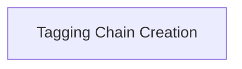

# Tagging Chains Module

## Introduction

The `tagging_chains` module provides functionalities for extracting structured information from unstructured text using language models, based on predefined schemas. It facilitates the creation of "tagging" chains that can identify and extract specific data points from a given passage.

## Architecture

The `tagging_chains` module is a part of `classic_chains_openai_functions.information_extraction`. It is composed of a single sub-module responsible for the creation of tagging chains.

<!-- DIAGRAM_JSON
{
    "direction": "TD",
    "nodes": [
        {"id": "tagging_chain_creation", "label": "Tagging Chain Creation", "type": "module", "link": "tagging_chain_creation.md"}
    ],
    "edges": [],
    "groups": []
}
-->

## Sub-modules

### [Tagging Chain Creation](tagging_chain_creation.md)

This sub-module contains the core logic for constructing tagging chains. It offers functions to create chains that can extract information based on either a dictionary schema or a Pydantic schema. It's important to note that the functions within this module are deprecated, and users are encouraged to utilize `with_structured_output` for modern implementations.
