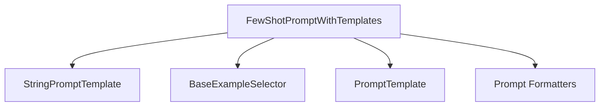

# template_based_few_shot_prompts

This module provides a robust framework for constructing prompts that incorporate few-shot examples. It allows developers to define illustrative examples directly or dynamically select them based on context, significantly enhancing the ability to guide language models with specific patterns and behaviors.

## Architecture and Core Components

The `template_based_few_shot_prompts` module centers around the `FewShotPromptWithTemplates` class, which extends the `StringPromptTemplate` to include a mechanism for few-shot learning.

### FewShotPromptWithTemplates

`FewShotPromptWithTemplates` is a powerful prompt template that integrates few-shot examples into a larger prompt structure. It facilitates the creation of highly customized and context-rich prompts by allowing precise control over example formatting, separation, and the overall prompt structure.

**Key Features:**

- **Flexible Example Handling**: Supports both a static list of `examples` and a dynamic `example_selector` (an instance of `BaseExampleSelector`) for choosing relevant examples based on input variables.
- **Customizable Structure**: Composed of an optional `prefix`, a series of formatted examples, and a `suffix`, all joined by a configurable `example_separator`.
- **Example Formatting**: Each individual example is formatted using a dedicated `PromptTemplate` (`example_prompt`), ensuring consistent presentation.
- **Template Format Options**: Supports various template formats, including `f-string`, `jinja2`, and `mustache`, through `DEFAULT_FORMATTER_MAPPING`.
- **Input Variable Validation**: Can validate template consistency to ensure all required input variables are correctly accounted for across the prefix, suffix, and partial variables.

### Component Relationships

<!-- DIAGRAM_JSON
{
    "direction": "TD",
    "nodes": [
        {"id": "few_shot_prompt_with_templates", "label": "FewShotPromptWithTemplates", "type": "component", "link": null},
        {"id": "string_prompt_template", "label": "StringPromptTemplate", "type": "external", "link": "string_prompt_templates.md"},
        {"id": "base_example_selector", "label": "BaseExampleSelector", "type": "external", "link": "core_example_selectors.md"},
        {"id": "prompt_template", "label": "PromptTemplate", "type": "external", "link": "base_prompt_template_core.md"},
        {"id": "prompt_formatters", "label": "Prompt Formatters", "type": "external", "link": "prompt_formatters.md"}
    ],
    "edges": [
        {"source": "few_shot_prompt_with_templates", "target": "string_prompt_template"},
        {"source": "few_shot_prompt_with_templates", "target": "base_example_selector"},
        {"source": "few_shot_prompt_with_templates", "target": "prompt_template"},
        {"source": "few_shot_prompt_with_templates", "target": "prompt_formatters"}
    ],
    "groups": []
}
-->

## Integration with the Overall System

The `template_based_few_shot_prompts` module resides within the `core_prompts.few_shot_prompts` package, making it a specialized component for advanced prompt engineering. It leverages the foundational capabilities of:

- **[core_prompts.prompt_templates_base](prompt_templates_base.md)**: Provides the base classes for prompt templates, including `StringPromptTemplate` and `PromptTemplate`, which `FewShotPromptWithTemplates` builds upon.
- **[core_example_selectors](core_example_selectors.md)**: Offers various strategies for selecting examples, allowing `FewShotPromptWithTemplates` to dynamically adapt the prompt content based on input.
- **[core_prompts.prompt_formatters](prompt_formatters.md)**: Enables different templating syntaxes (e.g., f-string, Jinja2, Mustache) for flexible prompt construction.

By combining these elements, `template_based_few_shot_prompts` empowers developers to create sophisticated, context-aware prompts that significantly improve the performance and relevance of language model interactions in a wide array of applications.
