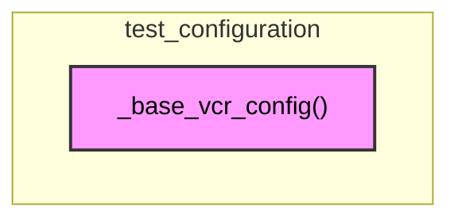

# test_configuration
This module defines a base VCR configuration function, `_base_vcr_config`, used for setting up VCR cassettes in tests.

<!-- DIAGRAM_JSON
{
  "nodes": [
    {
      "id": "test_configuration",
      "label": "test_configuration",
      "type": "module"
    },
    {
      "id": "_base_vcr_config",
      "label": "_base_vcr_config",
      "type": "function"
    }
  ],
  "edges": [
    {
      "source": "test_configuration",
      "target": "_base_vcr_config",
      "type": "contains"
    }
  ],
  "groups": [
    {
      "id": "test_configuration",
      "label": "test_configuration",
      "contains": [
        "_base_vcr_config"
      ]
    }
  ]
}
-->
